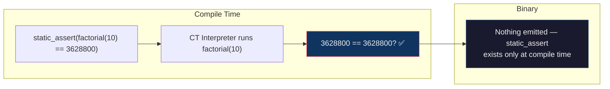
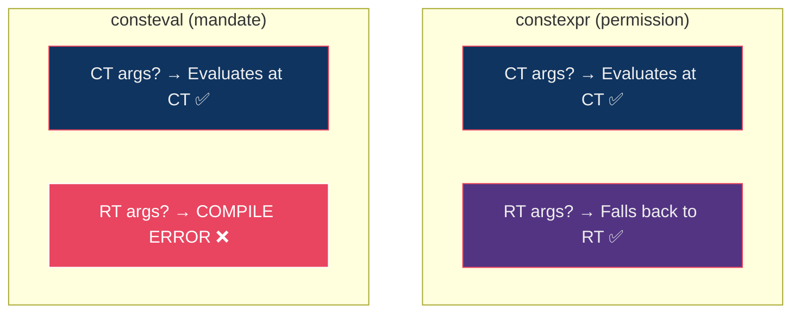
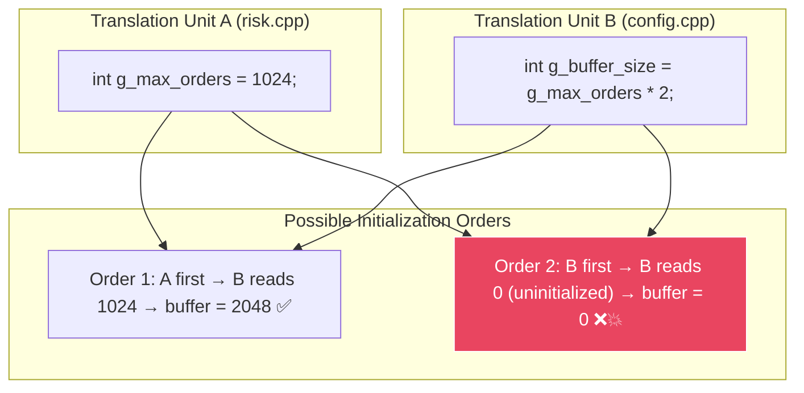
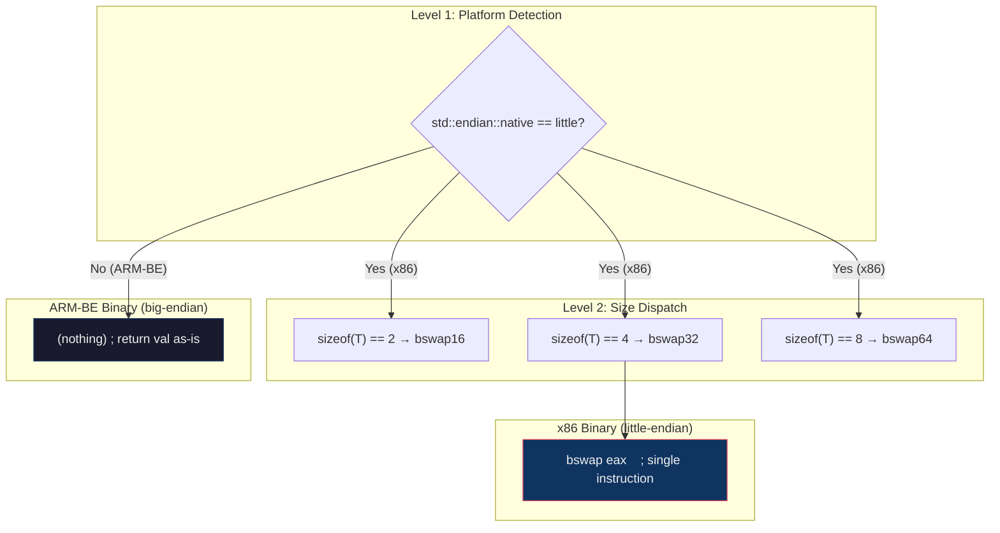

# Section 1 Deep Dive — `constexpr` Basics

> **Source**: [01_constexpr_basics.cpp](file:///Users/arkaj/Desktop/Low-Latency-CPP/mini_quote_engine/cpp-high-performance/09-compile-time-programming/code/01_constexpr_basics.cpp) (187 lines)
> **Build**: `g++ -std=c++20 -O2 -Wall -o 01_constexpr_basics 01_constexpr_basics.cpp`

---

## 📋 Program Output

```
=== constexpr Basics ===

factorial(10) = 3628800 (proven CT via static_assert)
kMaxOrders    = 1024
kMaxNotional  = 10240

to_string_ct(42)   = int:42
to_string_ct(3.14) = float:3.140000
to_string_ct('x')  = int:120

NasdaqConfig: max=2048 tick=0.01
CMEConfig:    max=512 tick=0.25

g_session_id  = 42 (constinit, can be modified)
g_risk_limit  = 1e+06
g_risk_limit  = 5e+06 (after update)
```

> [!NOTE]
> Notice `to_string_ct('x')` prints `int:120` — because `char` is an integral type, and `'x'` has ASCII value 120. The `is_integral_v<char>` branch is selected at compile time.

---

## 🔬 Section-by-Section Breakdown

### §1. Basic `constexpr` Function (Lines 23–34)

```cpp
constexpr int factorial(int n) {
    int result = 1;
    for (int i = 2; i <= n; i++) result *= i;
    return result;
}

static_assert(factorial(0)  == 1);
static_assert(factorial(5)  == 120);
static_assert(factorial(10) == 3628800);
```

#### What the Compiler Does



#### Mental Model

Think of `constexpr` as telling the compiler: *"You are ALLOWED to run this function at compile time."* It's a **permission**, not a command. The compiler will run it at CT **if and only if**:
1. All arguments are constant expressions
2. The result is used in a context that requires a constant expression (e.g., `static_assert`, `constexpr` variable init, template argument, array size)

If either condition fails, it falls back to a normal runtime function. Same code, two modes.

#### The C++14 Relaxation

Before C++14, `constexpr` functions could only contain a single `return` statement — no loops, no local variables, no `if` statements. This was extremely limiting. C++14 relaxed these rules dramatically:

| Allowed in `constexpr` | C++11 | C++14+ |
|------------------------|-------|--------|
| Local variables | ❌ | ✅ |
| Loops (`for`, `while`) | ❌ | ✅ |
| `if`/`else` | ❌ | ✅ |
| Multiple `return` statements | ❌ | ✅ |
| `try`/`catch` | ❌ | ✅ (C++20) |
| `virtual` calls | ❌ | ✅ (C++20) |

> [!IMPORTANT]
> **What's still NOT allowed in `constexpr`:**
> - `goto`
> - `asm` blocks  
> - Non-literal type allocations (before C++20 — C++20 allows transient allocations)
> - `reinterpret_cast`
> - Accessing `volatile` objects
> - Calling non-constexpr functions

---

### §2. `constexpr` Variables (Lines 40–45)

```cpp
constexpr int kMaxOrders   = 1024;
constexpr double kTickSize = 0.01;
constexpr double kMaxNotional = kMaxOrders * 1000.0 * kTickSize;

static_assert(kMaxNotional == 1024 * 1000.0 * 0.01);
```

#### Assembly Proof — Literal in `.rodata`

From the actual compiled assembly on your machine:

```asm
; kMaxNotional = 10240.0 — computed at compile time, stored as a literal
.quad   0x40c4000000000000    ; double 10240

; kMaxOrders = 1024 — used as immediate operand
mov     esi, 1024
```

The compiler doesn't emit code to multiply `1024 * 1000.0 * 0.01` at runtime. The result `10240.0` is pre-computed and embedded as a 64-bit IEEE 754 double literal (`0x40c4000000000000`) directly in the binary's read-only data section.

#### Mental Model: The Binary Layout

```
┌──────────────────────────────────────────────────┐
│ ELF/Mach-O Binary                                │
├──────────────────────────────────────────────────┤
│ .text section (executable code)                  │
│   main:                                          │
│     mov esi, 1024          ← kMaxOrders          │
│     movsd xmm0, [.rodata]  ← kMaxNotional       │
├──────────────────────────────────────────────────┤
│ .rodata section (read-only data)                 │
│   0x40c4000000000000       ← 10240.0             │
│   0x3f847ae147ae147b       ← 0.01                │
│   0x40d0000000000000       ← 0.25                │
└──────────────────────────────────────────────────┘
```

No computation code. No function calls. Just pre-baked numbers.

#### HFT Relevance

In an HFT system, configuration values like `kMaxOrders`, `kTickSize`, and `kMaxNotional` are known at build time (different builds for different venues). Making them `constexpr` means:
- **Zero initialization cost** — values are baked into the binary
- **Compiler can optimize with them** — e.g., if `kMaxOrders` is a power of 2, the compiler can use bit shifts instead of division
- **No cache miss** — the value is an immediate operand or a nearby `.rodata` address, always in L1

---

### §3. `consteval` — The Hard Guarantee (Lines 51–60)

```cpp
consteval int compile_time_only(int n) {
    return n * n;
}

static_assert(compile_time_only(7) == 49);   // ✅ works

// int x = 7;
// int y = compile_time_only(x);   // ❌ COMPILE ERROR
```

#### `constexpr` vs `consteval` — The Key Difference



| | `constexpr` | `consteval` |
|---|---|---|
| CT evaluation | ✅ If args are constant | ✅ Always |
| RT evaluation | ✅ Falls back silently | ❌ Compile error |
| Function exists in binary? | Yes (for RT calls) | **No** — eliminated entirely |
| Use case | General-purpose | Security/correctness critical |

#### When to Use `consteval`

Use `consteval` when a value **must never be computed at runtime** for correctness or security reasons:

1. **Encryption keys**: `consteval auto derive_key(...)` — the key derivation runs only at CT; no key material in runtime code paths
2. **Configuration validation**: `consteval bool validate_config(...)` — invalid configs rejected at build time
3. **Hash seeds**: `consteval uint64_t seed(...)` — hash seed is CT-only, prevents runtime manipulation
4. **Lookup table generation**: `consteval auto build_table(...)` — table is computed at CT, no startup cost

> [!TIP]
> `consteval` is a **contract enforcer**. It says: "If you accidentally pass a runtime value to this function, the compiler will stop you." This is stronger than a code review comment.

---

### §4. `constinit` — Solving the Static Initialization Order Fiasco (Lines 67–71)

```cpp
constinit int g_session_id = 42;
constinit double g_risk_limit = 1e6;

void update_risk_limit(double new_limit) { g_risk_limit = new_limit; }
```

#### The Problem: SIOF



C++ **does not guarantee** the initialization order of global variables across different translation units. This is the Static Initialization Order Fiasco. In HFT, this could mean your risk limit is `0` when the first order fires — a catastrophic bug that only manifests in specific link orders or platforms.

#### How `constinit` Fixes It

`constinit` forces the compiler to compute the initial value at compile time. The value is embedded in the binary's `.data` section (not `.rodata` because it's mutable). By the time any dynamic initialization runs, all `constinit` variables already have their correct values.

```
Program Startup Timeline:
━━━━━━━━━━━━━━━━━━━━━━━━━━━━━━━━━━━━━━━━━━━━━━━━━━━
│ Phase 1: Zero-init    │ All globals = 0           │
│ Phase 2: Constant-init│ constinit vars get their   │
│                       │ compile-time values        │
│ Phase 3: Dynamic-init │ Non-constinit globals      │ ← SIOF happens here
│                       │ initialized (order varies) │
│ Phase 4: main()       │ Your program runs          │
━━━━━━━━━━━━━━━━━━━━━━━━━━━━━━━━━━━━━━━━━━━━━━━━━━━
```

`constinit` variables are initialized in **Phase 2**, before the dangerous Phase 3. They're safe.

#### `constinit` vs `const` vs `constexpr`

| | `const` | `constexpr` | `constinit` |
|---|---|---|---|
| Initialized at CT? | Not guaranteed | Yes | Yes |
| Mutable at RT? | ❌ | ❌ | ✅ |
| Storage class restriction? | None | None | **Static/thread-local only** |
| Prevents SIOF? | ❌ | ✅ (but also immutable) | ✅ |

`constinit` fills the gap: *"I need compile-time initialization (to prevent SIOF), but I also need to modify this value at runtime."*

#### HFT Use Cases

```cpp
constinit int g_session_id = 42;        // Modified when session starts
constinit double g_risk_limit = 1e6;    // Modified when risk parameters update
constinit bool g_trading_enabled = false; // Flipped by control plane
```

All three start with known-good values before `main()` runs, but can be updated during the trading session.

---

### §5. `if constexpr` — Zero-Cost Branching (Lines 77–99)

```cpp
template <typename T>
std::string to_string_ct(T val) {
    if constexpr (std::is_integral_v<T>) {
        return "int:" + std::to_string(val);
    } else if constexpr (std::is_floating_point_v<T>) {
        return "float:" + std::to_string(val);
    } else {
        return "other";
    }
}
```

#### What Happens at Instantiation

When the compiler instantiates `to_string_ct<int>(42)`:

```
Step 1: is_integral_v<int> → true
Step 2: First branch is KEPT
Step 3: All else branches are DISCARDED — not compiled, not type-checked
        (they could contain syntax errors for int and it wouldn't matter)

The compiler generates ONLY:
    return "int:" + std::to_string(val);
```

#### Assembly Proof — Three Different Instantiations

From the actual assembly on your machine:

```asm
; to_string_ct(42) — integer path
mov     esi, 42
call    std::to_string(int)           ; calls the int overload

; to_string_ct(3.14) — floating-point path  
movsd   xmm0, [3.14]
call    std::to_string(double)        ; calls the double overload

; to_string_ct('x') — also integer path! (char is integral)
mov     esi, 120                      ; 'x' = ASCII 120
call    std::to_string(int)           ; calls the int overload
```

Each instantiation produces **exactly one** code path. No branches, no runtime checks. The discarded branches don't exist in the binary.

#### `if constexpr` vs Regular `if`

| | Regular `if` | `if constexpr` |
|---|---|---|
| Both branches compiled? | ✅ Yes | ❌ Only the true branch |
| Both branches must type-check? | ✅ Yes | ❌ Only the true branch |
| Runtime branch instruction? | ✅ `je`/`jne` in binary | ❌ No branch at all |
| Can call non-existent methods? | ❌ Compile error | ✅ In the false branch, anything goes |

That last row is the crucial one. Consider:

```cpp
template <typename T>
void process(T val) {
    if constexpr (std::is_integral_v<T>) {
        std::cout << val * 2;         // fine for ints
    } else {
        val.serialize();              // only valid if T has serialize()
        // If T = int, this branch is DISCARDED before type-checking
        // With regular 'if', this would be a compile error for int
    }
}
```

#### HFT Pattern: Zero-Copy Serialization

```cpp
template <typename T>
void serialize_to_buffer(const T& val, char* buf) {
    if constexpr (std::is_trivially_copyable_v<T>) {
        __builtin_memcpy(buf, &val, sizeof(T));  // ~1 ns — single memcpy
    } else {
        val.serialize(buf);  // custom serialization — only for complex types
    }
}
```

For a POD struct like `QuoteMessage`, the compiler emits a single `memcpy` of known size. The `else` branch doesn't exist — there's no `.serialize()` call, no vtable, no indirection. The compiler can even vectorize the `memcpy` into a SIMD store if the size is right.

---

### §6. Endian Swap — `constexpr` + `if constexpr` Combined (Lines 107–119)

```cpp
template <typename T>
constexpr T from_big_endian(T val) {
    static_assert(std::is_integral_v<T>, "T must be integral");
    if constexpr (std::endian::native == std::endian::little) {
        if constexpr (sizeof(T) == 2) return __builtin_bswap16(val);
        if constexpr (sizeof(T) == 4) return __builtin_bswap32(val);
        if constexpr (sizeof(T) == 8) return __builtin_bswap64(val);
    }
    return val;
}
```

#### Platform-Dependent Compilation

This function demonstrates **two levels** of `if constexpr`:



On your x86 Mac, calling `from_big_endian<uint32_t>(val)` compiles down to a **single `bswap` instruction** — 1 cycle, no branches, no function call overhead. On a big-endian machine, the compiler emits **nothing** — the function is a complete no-op.

#### Real HFT Context

Market data protocols like **CME MDP3.0**, **NASDAQ ITCH**, and **NYSE Arca** transmit data in network byte order (big-endian). An HFT system on x86 must swap every price, quantity, and sequence number. With `from_big_endian`:

```cpp
// Parsing a market data packet — each field is 1 bswap instruction
auto seq_num  = from_big_endian(*(uint64_t*)(buf + 0));   // bswap rax
auto price    = from_big_endian(*(int32_t*)(buf + 8));    // bswap eax
auto quantity = from_big_endian(*(int32_t*)(buf + 12));   // bswap eax
```

Three instructions. No branches. No function call overhead. The `constexpr` nature means these can even be evaluated at compile time for test data.

---

### §7. CT vs RT Proof — The Dual Nature (Lines 125–136)

```cpp
void demonstrate_ct_vs_rt() {
    // CT: result embedded as literal in binary
    constexpr int ct_result = factorial(12);
    std::cout << "CT factorial(12) = " << ct_result << "\n";

    // RT: value from stdin — cannot evaluate at CT
    int n;
    std::cout << "Enter n for factorial: ";
    std::cin >> n;
    int rt_result = factorial(n);
    std::cout << "RT factorial(" << n << ") = " << rt_result << "\n";
}
```

#### Assembly Proof — Same Function, Two Worlds

This is the most revealing part of the assembly. The **same function** `factorial()` appears in two completely different forms:

**Compile-time call** — `constexpr int ct_result = factorial(12)`:
```asm
mov     esi, 479001600    ; 12! = 479001600, hardcoded as a literal
call    ostream::operator<<(int)
```

The compiler ran `factorial(12)` during compilation and replaced the entire call with the literal `479001600`. No loop, no multiplication, no function call. Just a number.

**Runtime call** — `int rt_result = factorial(n)` where `n` comes from `cin`:
```asm
; The compiler generates an ACTUAL loop — and vectorizes it with SIMD!
pmovsxbd xmm0, [1,1,1,1]    ; load initial values
pmovsxbd xmm1, [2,3,4,5]    ; load multiplier seeds
pmovsxbd xmm3, [4,4,4,4]    ; step increment
pmovsxbd xmm4, [8,8,8,8]    ; unroll factor

LBB1_4:                       ; vectorized loop — processes 8 iterations per step
    pmulld  xmm2, xmm5       ; SIMD multiply (4 ints at once)
    pmulld  xmm0, xmm1       ; another batch
    paddd   xmm1, xmm4       ; increment
    jne     LBB1_4            ; loop

pshufd  xmm0, xmm2, 238      ; horizontal reduction
pmulld  xmm0, xmm2           ; combine partial products
pshufd  xmm1, xmm0, 85
pmulld  xmm1, xmm0           ; final result
movd    ebx, xmm1            ; extract scalar result
```

> [!IMPORTANT]
> **The compiler vectorized the factorial loop with SSE4 SIMD instructions!** It processes 4 multiplications in parallel using 128-bit XMM registers (`pmulld` = packed multiply of 32-bit integers). This is `-O2` doing its job — the same `constexpr` function that evaluated at compile time for constant args now runs as an **auto-vectorized SIMD loop** for runtime args.

#### The Dual-Mode Timeline

```
Source Code:          constexpr int factorial(int n) { ... }
                                   │
                      ┌────────────┴────────────┐
                      ▼                         ▼
              CT Context                  RT Context
         constexpr int x =            int n = user_input;
           factorial(12);              int y = factorial(n);
                │                           │
                ▼                           ▼
         Compiler evaluates          Compiler emits machine code:
         factorial(12) = 479001600   vectorized SIMD loop
                │                           │
                ▼                           ▼
         Binary: mov esi, 479001600  Binary: pmulld/paddd/jne loop
         Cost: 0 ns                  Cost: ~5-20 ns depending on n
```

---

### §8. `constexpr` Class — Compile-Time Config Objects (Lines 142–158)

```cpp
struct VenueConfig {
    int    max_orders;
    double tick_size;
    double max_notional;

    constexpr VenueConfig(int max, double tick)
        : max_orders(max)
        , tick_size(tick)
        , max_notional(max * tick * 1000.0) {}
};

constexpr VenueConfig kNasdaqConfig { 2048, 0.01 };
constexpr VenueConfig kCMEConfig    { 512,  0.25 };

static_assert(kNasdaqConfig.max_orders == 2048);
static_assert(kCMEConfig.tick_size     == 0.25);
```

#### What Makes a Type "Literal" (Usable in `constexpr`)

For a class to be used as a `constexpr` variable, it must be a **literal type**:

1. ✅ Trivial or `constexpr` destructor
2. ✅ At least one `constexpr` constructor (not a copy/move constructor)
3. ✅ All non-static data members are literal types
4. ❌ No `virtual` base classes (until C++20, which relaxed some rules)

`VenueConfig` satisfies all of these — its constructor is `constexpr`, its members (`int`, `double`) are literal types, and its destructor is trivial.

#### Derived Values at Compile Time

The key insight: `max_notional(max * tick * 1000.0)` is a **derived value** computed during `constexpr` construction. You define the primary inputs (`max_orders`, `tick_size`), and the constructor computes dependent values. All at compile time.

This is the compile-time equivalent of a builder pattern — but with zero runtime cost.

#### HFT Pattern: Per-Venue Configuration

```cpp
constexpr VenueConfig kNasdaqConfig { 2048, 0.01 };  // equity venue
constexpr VenueConfig kCMEConfig    { 512,  0.25 };  // futures venue
constexpr VenueConfig kBATSConfig   { 4096, 0.001 }; // high-frequency venue

// All of these are in .rodata — no heap, no initialization code, no SIOF
// The compiler can use these values for further optimizations:
// e.g., if max_orders is a power of 2, modulo becomes a bitmask
```

---

## 🧠 Key Mental Models to Remember

### 1. The `constexpr` Decision Tree

```
"Can I evaluate this at compile time?"
    ├── All inputs constant?
    │   ├── YES → CT evaluation → literal in binary (0 ns)
    │   └── NO  → RT evaluation → normal machine code
    └── Result used in constexpr context?
        ├── YES → MUST succeed at CT (else compile error)
        └── NO  → May still evaluate at CT (compiler's choice)
```

### 2. The Three Keywords as a Spectrum

```
     constinit          constexpr              consteval
  ◄─────────────────────────────────────────────────────►
  "init value at CT     "try CT first,         "CT or die"
   but stay mutable"    fall back to RT"
```

### 3. `if constexpr` = Compile-Time `#ifdef`

Think of `if constexpr` as a type-safe, scoped version of `#ifdef`. The false branch is **discarded** (like `#ifdef` excludes code), but unlike `#ifdef`:
- It's scoped to the function
- It can depend on template parameters
- It doesn't pollute the preprocessor namespace
- The true branch IS type-checked

---

## ⚡ Runtime Cost Summary for This File

| Construct | Cost | Where in binary |
|-----------|------|----------------|
| `static_assert(factorial(10) == 3628800)` | **0 ns** | Nowhere — compile-time only |
| `constexpr int kMaxOrders = 1024` | **0 ns** | `.rodata` or immediate operand |
| `constexpr VenueConfig kCMEConfig{...}` | **0 ns** | `.rodata` section |
| `consteval compile_time_only(7)` | **0 ns** | Literal 49 embedded |
| `constinit int g_session_id = 42` | **0 ns init** | `.data` section (mutable) |
| `if constexpr` true branch | **0 ns overhead** | Only true branch compiled |
| `if constexpr` false branch | **doesn't exist** | Discarded entirely |
| `from_big_endian<uint32_t>(val)` | **1 cycle** | Single `bswap` instruction |
| `factorial(n)` with runtime n | **~5-20 ns** | Vectorized SIMD loop |
