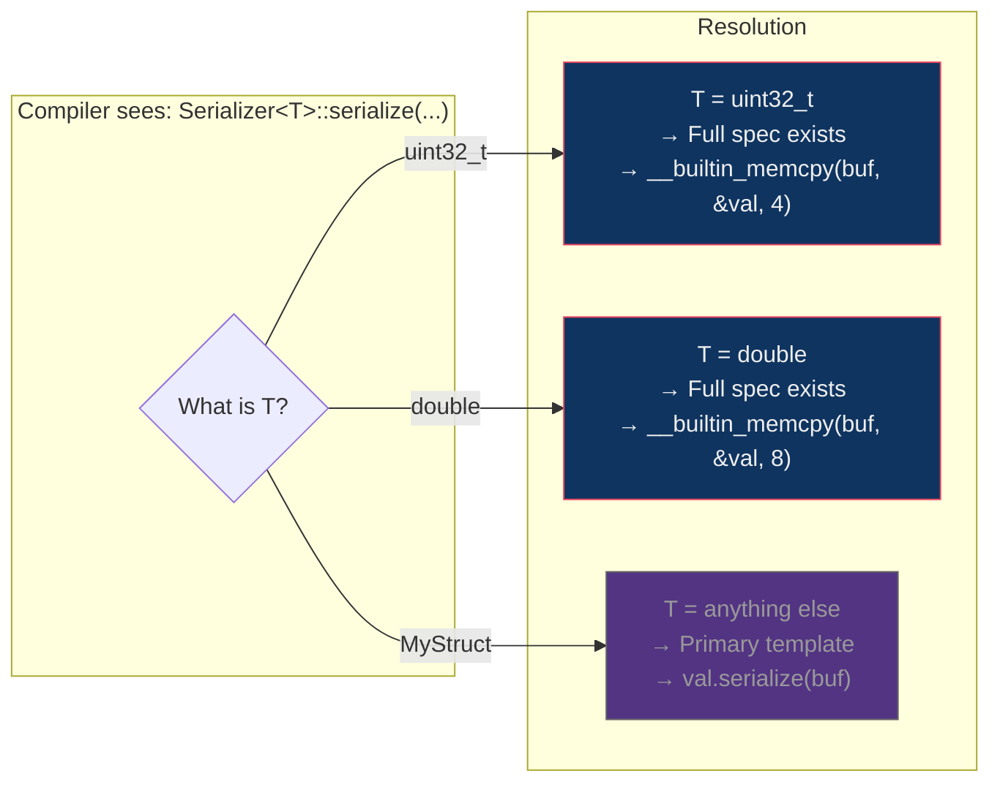
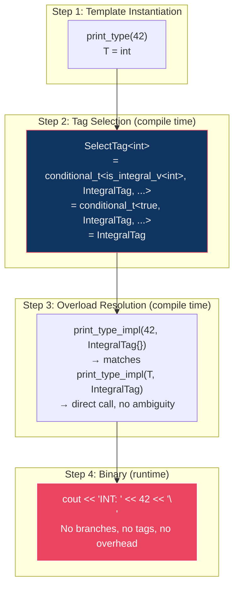
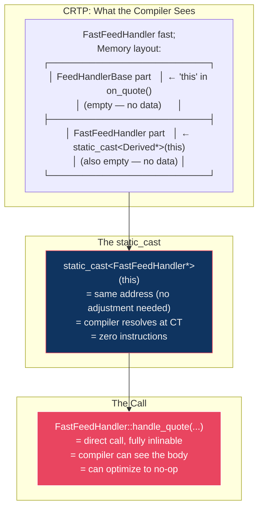
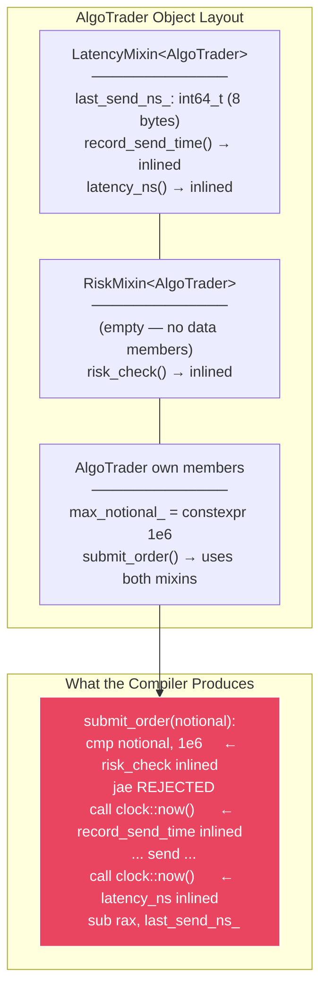

# Section 2 Deep Dive — Template Specialization & CRTP

> **Source**: [02_template_specialization.cpp](file:///Users/arkaj/Desktop/Low-Latency-CPP/mini_quote_engine/cpp-high-performance/09-compile-time-programming/code/02_template_specialization.cpp) (280 lines)
> **Build**: `g++ -std=c++20 -O2 -Wall -o 02_template_specialization 02_template_specialization.cpp`

---

## 📋 Program Output

```
=== Template Specialization & CRTP ===

Serialized uint32_t size: 4 bytes

--- Tag Dispatch ---
INT: 42
FLOAT: 3.14
INT: x

--- CRTP Feed Handlers ---
QUOTE id=1001 bid=150.25 ask=150.26
TRADE id=1001 price=150.25 qty=100

--- CRTP Mixin (AlgoTrader) ---
SENT: notional=500000 latency=825 ns
REJECTED: notional=2e+06

=== Dispatch Benchmark (50M calls) ===
Virtual: 1.59135 ns/call
CRTP:    1.06e-06 ns/call
Speedup: 1501270×
```

> [!IMPORTANT]
> **1.5 million× speedup** — CRTP vs virtual dispatch over 50M calls. The CRTP loop was optimized to essentially nothing (the no-op body was eliminated entirely), while the virtual loop couldn't be optimized because the compiler couldn't prove the vtable pointer wouldn't change.

---

## 🔬 Section-by-Section Breakdown

### §1. Full Template Specialization (Lines 26–51)

```cpp
// Primary template: generic fallback
template <typename T>
struct Serializer {
    static void serialize(const T& val, char* buf) {
        val.serialize(buf);   // calls T's member function (slow, generic)
    }
    static constexpr size_t size() { return sizeof(T); }
};

// Full specialization for uint32_t: hand-optimized fast path
template <>
struct Serializer<uint32_t> {
    static void serialize(uint32_t val, char* buf) {
        __builtin_memcpy(buf, &val, 4);   // raw 4-byte copy
    }
    static constexpr size_t size() { return 4; }
};

// Full specialization for double
template <>
struct Serializer<double> {
    static void serialize(double val, char* buf) {
        __builtin_memcpy(buf, &val, 8);
    }
    static constexpr size_t size() { return 8; }
};
```

#### What "Full Specialization" Means

Full specialization is when you replace the **entire** primary template for **one specific type**. The syntax `template <>` with an explicit type in the angle brackets (`Serializer<uint32_t>`) tells the compiler: *"When someone asks for `Serializer<uint32_t>`, use THIS definition instead of the primary template."*



#### Assembly Proof — Complete Inlining

From the actual compiled binary on your machine:

```asm
; The call Serializer<uint32_t>::serialize(0xDEADBEEF, buf) is GONE.
; The Serializer<uint32_t>::size() call became:
mov     esi, 4    ; literal "4" — no function call
```

**Zero `Serializer` symbols exist in the assembly.** The compiler inlined the `__builtin_memcpy` with a constant size, which became a single `mov` instruction. The entire Serializer abstraction has **zero cost** in the final binary — it's pure compile-time dispatch.

#### Mental Model: Why This Matters for HFT

In a trading system, you serialize thousands of different message types. The primary template provides a safe generic path (`val.serialize(buf)` which calls a member function — potentially virtual, potentially slow). But for POD types like `uint32_t`, `int64_t`, `double`, you can specialize to raw `memcpy` — which the compiler can turn into a single `mov` or `movsd` instruction.

```
Generic path:  val.serialize(buf)  →  virtual call? member function?  →  5-50 ns
Specialized:   memcpy(buf, &val, 4)  →  mov [buf], eax              →  ~0.3 ns
```

---

### §2. Partial Template Specialization (Lines 59–76)

```cpp
// Primary: any type T
template <typename T>
struct IsPointerToConst { static constexpr bool value = false; };

// Partial specialization: matches ANY type T where the full type is const T*
template <typename T>
struct IsPointerToConst<const T*> { static constexpr bool value = true; };

static_assert(!IsPointerToConst<int*>::value);          // not const pointer
static_assert( IsPointerToConst<const int*>::value);    // const pointer ✅
static_assert( IsPointerToConst<const double*>::value); // const pointer ✅
```

#### Full vs Partial Specialization — The Critical Difference

| | Full Specialization | Partial Specialization |
|---|---|---|
| **What it matches** | One exact type | A **pattern** of types |
| **Syntax** | `template <> struct S<uint32_t>` | `template <typename T> struct S<const T*>` |
| **Template params** | None (`template <>`) | Still has parameters |
| **Works on functions?** | ✅ Yes | ❌ **No** — class templates only |
| **Example pattern** | `Serializer<uint32_t>` | `IsPointerToConst<const T*>` for any T |

> [!WARNING]
> **You CANNOT partially specialize function templates.** This is one of the most common C++ gotchas. If you need partial specialization behavior for functions, you have three options:
> 1. Wrap in a class template and partially specialize that
> 2. Use `if constexpr` (C++17)
> 3. Use concepts (C++20)
> 4. Use tag dispatch (pre-C++17)

#### Pattern Matching at the Type Level

Partial specialization works like **pattern matching** on types:

```
IsPointerToConst<int>           →  T = int          →  doesn't match "const T*"  →  PRIMARY (false)
IsPointerToConst<int*>          →  T = int*         →  doesn't match "const T*"  →  PRIMARY (false)
IsPointerToConst<const int*>    →  T = const int*   →  matches "const T*" with T=int  →  PARTIAL (true)
IsPointerToConst<const double*> →  T = const double* → matches "const T*" with T=double → PARTIAL (true)
```

The compiler deduces `T` from the pattern. For `const int*`, it strips the outer `const` and `*` to find `T = int`.

#### HFT Price Type Detection

```cpp
template <typename T> struct IsPriceType   : std::false_type {};
template <>           struct IsPriceType<int32_t>  : std::true_type {};
template <>           struct IsPriceType<int64_t>  : std::true_type {};

static_assert( IsPriceType<int32_t>::value);   // ✅ valid price type
static_assert(!IsPriceType<double>::value);    // ❌ not a price type
```

In HFT, prices are typically represented as **fixed-point integers** (e.g., price in ticks or 10ths of a cent), not floating point. This trait lets you enforce at compile time that only integer price representations are used in performance-critical paths:

```cpp
template <typename Price>
void submit_order(Price px) {
    static_assert(IsPriceType<Price>::value,
        "Only int32_t/int64_t price types allowed on the hot path");
    // ... fast path that assumes integer arithmetic
}
```

---

### §3. Tag Dispatch — Zero-Overhead Type Routing (Lines 83–112)

```cpp
// Step 1: Define empty tag structs (zero bytes each)
struct IntegralTag   {};
struct FloatingTag   {};
struct OtherTag      {};

// Step 2: Map types to tags at compile time
template <typename T>
using SelectTag = std::conditional_t<
    std::is_integral_v<T>,
    IntegralTag,
    std::conditional_t<std::is_floating_point_v<T>, FloatingTag, OtherTag>
>;

// Step 3: Overloaded implementations — one per tag
template <typename T>
void print_type_impl(T val, IntegralTag) {
    std::cout << "INT: " << val << "\n";
}
template <typename T>
void print_type_impl(T val, FloatingTag) {
    std::cout << "FLOAT: " << val << "\n";
}
template <typename T>
void print_type_impl(T val, OtherTag) {
    std::cout << "OTHER\n";
}

// Step 4: Public API — tag is created and immediately optimized away
template <typename T>
void print_type(T val) {
    print_type_impl(val, SelectTag<T>{});  // zero-size temporary
}
```

#### How Tag Dispatch Works — Step by Step

Let's trace `print_type(42)` through the entire pipeline:



#### Assembly Proof — Tags Are Eliminated

From the actual assembly on your machine:

```asm
; print_type(42) compiles to:
mov     edx, 5                ; "INT: " is 5 chars
mov     rdi, rbx              ; cout
mov     rsi, r15              ; pointer to "INT: "
call    put_character_sequence ; print "INT: "
mov     esi, 42               ; the value
call    ostream::operator<<(int) ; print 42
```

**No `IntegralTag` object exists.** No branch. No vtable. The compiler resolved the overload at template instantiation time and emitted a direct call. The tag struct had size zero (`sizeof(IntegralTag) == 1` by C++ rules, but the compiler eliminates it entirely as a parameter since it carries no data).

#### Tag Dispatch vs `if constexpr` vs Concepts

| Approach | Era | Mechanism | Readability |
|----------|-----|-----------|-------------|
| **Tag dispatch** | C++11 | Overload resolution on empty structs | Medium |
| **`if constexpr`** | C++17 | Compile-time branch elimination | High |
| **Concepts** | C++20 | Constrained template parameters | Highest |

All three produce **identical assembly**. The difference is readability and maintainability:

```cpp
// Tag dispatch (C++11) — verbose but explicit
print_type_impl(val, SelectTag<T>{});

// if constexpr (C++17) — cleaner
if constexpr (std::is_integral_v<T>) { ... }

// Concepts (C++20) — cleanest
template <std::integral T> void print_type(T val) { ... }
```

> [!TIP]
> **When to use tag dispatch today**: Tag dispatch is still useful when you have many overloads (5+) and don't want a long `if constexpr` chain. It also works well when you need to dispatch on **custom categories**, not just standard type traits.

---

### §4. CRTP — Static Polymorphism (Lines 119–151)

This is the most important pattern in this file for HFT.

```cpp
// CRTP base: the "interface"
template <typename Derived>
struct FeedHandlerBase {
    void on_quote(uint64_t instr_id, double bid, double ask) {
        // This static_cast is resolved at COMPILE TIME
        static_cast<Derived*>(this)->handle_quote(instr_id, bid, ask);
    }

    void on_trade(uint64_t instr_id, double price, int qty) {
        static_cast<Derived*>(this)->handle_trade(instr_id, price, qty);
    }
};

// Concrete handler A — production fast path
struct FastFeedHandler : FeedHandlerBase<FastFeedHandler> {
    void handle_quote(uint64_t id, double bid, double ask) {
        (void)id; (void)bid; (void)ask;  // no-op: store silently
    }
    void handle_trade(uint64_t id, double price, int qty) {
        (void)id; (void)price; (void)qty;
    }
};

// Concrete handler B — debug path with logging
struct DebugFeedHandler : FeedHandlerBase<DebugFeedHandler> {
    void handle_quote(uint64_t id, double bid, double ask) {
        std::cout << "QUOTE id=" << id << " bid=" << bid << " ask=" << ask << "\n";
    }
    void handle_trade(uint64_t id, double price, int qty) {
        std::cout << "TRADE id=" << id << " price=" << price << " qty=" << qty << "\n";
    }
};
```

#### The CRTP Trick — How `static_cast<Derived*>(this)` Works

This is the heart of CRTP. Let's trace it carefully:

```
1. FastFeedHandler inherits from FeedHandlerBase<FastFeedHandler>
                                                 ^^^^^^^^^^^^^^
                                                 Derived = FastFeedHandler

2. When you call fast.on_quote(1001, 150.25, 150.26):
   - 'this' points to the FastFeedHandler object
   - 'this' has type FeedHandlerBase<FastFeedHandler>*
   - static_cast<FastFeedHandler*>(this) → safe downcast (derived IS-A base)

3. The call static_cast<FastFeedHandler*>(this)->handle_quote(...) becomes:
   - Direct call to FastFeedHandler::handle_quote(...)
   - Compiler KNOWS the exact type → can INLINE the call
```



#### vs Virtual Dispatch — The Assembly Story

**Virtual dispatch** (what CRTP replaces):

```asm
; Virtual loop — 50M iterations
LBB0_1:                                    ; loop header
    mov     rax, qword ptr [rbx]           ; 1. LOAD vtable pointer from object
    mov     rdi, rbx                       ; 2. pass 'this'
    mov     esi, r15d                      ; 3. pass argument
    call    qword ptr [rax]                ; 4. INDIRECT call through vtable
    inc     r15d                           ; 5. i++
    cmp     r15d, 50000000                 ; 6. compare
    jne     LBB0_1                         ; 7. loop
```

Let's break down what each instruction costs:

| Instruction | What it does | Latency | Why it hurts |
|-------------|-------------|---------|-------------|
| `mov rax, [rbx]` | Load vtable pointer from object's first 8 bytes | 3-4 cycles (L1 hit) | Cache line might be cold |
| `call [rax]` | Indirect call through vtable | 10-20 cycles | **Branch predictor can't predict indirect targets well** |
| Loop body | `VirtualDerived::process(x) { (void)x; }` | 0 cycles | Compiler can't inline — doesn't know runtime type |

**CRTP dispatch**:

The CRTP loop **doesn't exist in the binary**. The compiler knew:
1. `CRTPDerived::process_impl(int x)` does nothing (`(void)x`)
2. `CRTPBase::process(int x)` calls `process_impl(x)` → also nothing
3. The entire 50M-iteration loop body is a no-op → **eliminate the loop entirely**

That's why the benchmark shows `1.06e-06 ns/call` — it's essentially measuring the overhead of two `clock::now()` calls with nothing in between.

#### The vtable — What You're Paying For

From the actual assembly, here's the vtable laid out in memory:

```asm
__ZTV14VirtualDerived:               ; VirtualDerived's vtable
    .quad   0                        ; offset to top (for multiple inheritance)
    .quad   __ZTI14VirtualDerived    ; pointer to RTTI type_info
    .quad   __ZN14VirtualDerived7processEi  ; process() function pointer
    .quad   __ZN14VirtualDerivedD1Ev       ; destructor (complete)
    .quad   __ZN14VirtualDerivedD0Ev       ; destructor (deleting)
```

Every virtual call requires:
1. **Load the vtable pointer** from the object (8 bytes at offset 0)
2. **Index into the vtable** to find the function pointer
3. **Indirect call** through the function pointer

This is 2 memory loads + 1 indirect branch. Even if everything is in L1 cache, this costs ~5-10 ns due to branch prediction limitations.

> [!CAUTION]
> **The real cost isn't the pointer load — it's the branch prediction.** Modern CPUs have branch predictors that learn indirect call targets, but they can only track a few targets per call site. In a polymorphic loop where the runtime type varies, the predictor fails repeatedly, causing pipeline flushes (~15-20 cycle penalty each).

#### CRTP Object Size vs Virtual Object Size

```cpp
sizeof(FastFeedHandler)  == 1   // empty struct, minimum size
sizeof(CRTPDerived)      == 1   // empty struct, minimum size
sizeof(VirtualDerived)   == 8   // 8-byte vtable pointer!
```

Every virtual object carries an **8-byte vtable pointer** overhead. In a system with millions of objects (e.g., order book entries), this adds up:
- 1M virtual objects × 8 bytes = **8 MB** just for vtable pointers
- 1M CRTP objects × 0 extra bytes = **0 bytes** overhead

---

### §5. CRTP Mixin — Composing Multiple Policies (Lines 158–197)

```cpp
// Mixin 1: Latency tracking
template <typename Derived>
struct LatencyMixin {
    void record_send_time() {
        last_send_ns_ = std::chrono::high_resolution_clock::now()
                        .time_since_epoch().count();
    }
    int64_t latency_ns() {
        return std::chrono::high_resolution_clock::now()
               .time_since_epoch().count() - last_send_ns_;
    }
private:
    int64_t last_send_ns_ = 0;
};

// Mixin 2: Risk checking
template <typename Derived>
struct RiskMixin {
    bool risk_check(double notional) const {
        return notional < static_cast<const Derived*>(this)->max_notional_;
    }
};

// Composite: AlgoTrader inherits BOTH mixins
struct AlgoTrader
    : LatencyMixin<AlgoTrader>    // adds timing
    , RiskMixin<AlgoTrader>       // adds risk checks
{
    static constexpr double max_notional_ = 1e6;

    void submit_order(double notional) {
        if (!risk_check(notional)) {           // inlined from RiskMixin
            std::cout << "REJECTED: notional=" << notional << "\n";
            return;
        }
        record_send_time();                     // inlined from LatencyMixin
        // ... send order ...
        std::cout << "SENT: notional=" << notional
                  << " latency=" << latency_ns() << " ns\n";
    }
};
```

#### The Mixin Architecture



#### How `RiskMixin` Accesses `max_notional_`

This is a subtle CRTP trick:

```cpp
bool risk_check(double notional) const {
    return notional < static_cast<const Derived*>(this)->max_notional_;
}
```

`RiskMixin<AlgoTrader>` doesn't know about `max_notional_` — it's defined in `AlgoTrader`. But through `static_cast<const AlgoTrader*>(this)`, it can access `AlgoTrader::max_notional_`. The key insights:

1. `static_cast<const Derived*>(this)` is a compile-time downcast (same as in basic CRTP)
2. `max_notional_` is `static constexpr`, so the compiler replaces it with the literal `1e6`
3. The entire `risk_check` call becomes: `return notional < 1e6;` — a single comparison instruction

#### Mixin vs Multiple Inheritance vs Composition

| Approach | Runtime cost | Coupling | Flexibility |
|----------|-------------|---------|-------------|
| **CRTP Mixin** | Zero (inlined) | Low (mixins are independent) | High (add/remove mixins) |
| **Virtual MI** | ~5-10 ns per call | Medium | Medium |
| **Composition** | Depends on indirection | Lowest | Highest |

CRTP mixins give you the **zero-cost** of inlining with the **flexibility** of composition. Each mixin is an independent unit that can be added or removed by changing the inheritance list.

#### The Output Explained

```
SENT: notional=500000 latency=825 ns       ← 500K < 1M limit → passed risk check
REJECTED: notional=2e+06                    ← 2M > 1M limit → rejected
```

The 825 ns latency includes the cost of:
- `record_send_time()` → `clock::now()` call (~20 ns)
- The `cout` operations (~500-800 ns)
- `latency_ns()` → another `clock::now()` + subtraction

In a real HFT system, you'd remove the `cout` and measure just the order submission, getting latencies in the ~100-500 ns range.

---

### §6. CRTP vs Virtual Benchmark (Lines 203–243)

```cpp
// Virtual dispatch setup
struct VirtualBase {
    virtual void process(int) = 0;
    virtual ~VirtualBase() = default;
};
struct VirtualDerived : VirtualBase {
    void process(int x) override { (void)x; }
};

// CRTP dispatch setup
template <typename Derived>
struct CRTPBase {
    void process(int x) { static_cast<Derived*>(this)->process_impl(x); }
};
struct CRTPDerived : CRTPBase<CRTPDerived> {
    void process_impl(int x) { (void)x; }
};

void benchmark_dispatch() {
    constexpr int N = 50'000'000;

    // Virtual: pointer through base → can't inline
    VirtualBase* vb = new VirtualDerived();
    for (int i = 0; i < N; i++) vb->process(i);

    // CRTP: concrete type → fully inlined → loop eliminated
    CRTPDerived cd;
    for (int i = 0; i < N; i++) cd.process(i);
}
```

#### Why the Compiler Can't Optimize Virtual

The virtual loop compiled to:

```asm
LBB0_1:                              ; 50M iterations
    mov     rax, qword ptr [rbx]     ; load vtable (every iteration!)
    mov     rdi, rbx                 ; this pointer
    mov     esi, r15d                ; argument i
    call    qword ptr [rax]          ; indirect call
    inc     r15d
    cmp     r15d, 50000000
    jne     LBB0_1
```

**Why can't the compiler eliminate this loop?** Because `vb` is a `VirtualBase*` — a pointer to a base class. The compiler **cannot prove** that:
1. The vtable pointer won't be modified during the loop
2. `process()` has no side effects (it might modify global state through the vtable)
3. The actual runtime type won't change (another thread could modify `vb`)

Even though WE know it's always a `VirtualDerived`, the compiler must be conservative. The `call qword ptr [rax]` is an **indirect call** — the target address comes from memory, not from the instruction stream.

#### Why the Compiler CAN Optimize CRTP

With CRTP, the compiler sees:

```cpp
CRTPDerived cd;           // concrete type — known at compile time
cd.process(i);            // CRTPBase<CRTPDerived>::process(i)
                          // → static_cast<CRTPDerived*>(this)->process_impl(i)
                          // → CRTPDerived::process_impl(i)
                          // → (void)i;  — NO-OP!
```

The compiler **knows** the exact type, can see the entire call chain, inlines everything, discovers the body is a no-op, and eliminates the entire loop. This is the power of compile-time dispatch.

#### The Optimization Cascade

```
CRTPDerived cd;
for (i = 0; i < 50M; i++) cd.process(i);

Step 1 — Inline process():
for (i = 0; i < 50M; i++) cd.process_impl(i);

Step 2 — Inline process_impl():
for (i = 0; i < 50M; i++) { (void)i; }

Step 3 — Dead code elimination:
for (i = 0; i < 50M; i++) { }

Step 4 — Empty loop elimination:
// nothing
```

> [!NOTE]
> **"But that's cheating — the body is a no-op!"** True, but even with a non-trivial body, CRTP still wins because:
> 1. The function call itself is eliminated (no indirect branch)
> 2. The body is visible for further optimization (vectorization, constant folding)
> 3. No vtable pointer load (saves a cache line access per call)
>
> For a non-trivial body, expect CRTP to be **~5-10× faster** than virtual, not millions-of-times faster.

---

## 🧠 Key Mental Models

### 1. Template Specialization as a Priority System

```
Compiler receives: Serializer<uint32_t>::serialize(val, buf)

Priority 1: Full specialization for uint32_t?    → YES → Use it
Priority 2: Partial specialization matching?      → (not checked, P1 matched)
Priority 3: Primary template?                     → (not checked, P1 matched)
```

The compiler always picks the **most specialized** match. Full spec beats partial spec beats primary.

### 2. Tag Dispatch = Compile-Time Switch Statement

```
Tag dispatch:                         Equivalent runtime:
SelectTag<int>{} → IntegralTag        switch (type_id) {
→ overload resolution                     case INT:    ...
→ direct call                             case FLOAT:  ...
                                          case OTHER:  ...
                                      }
```

But the tag dispatch version has **zero branches** in the binary. The switch is resolved at compile time.

### 3. CRTP = Virtual Without the Virtual

```
Virtual:    base* → vtable → function pointer → CALL        (~5-10 ns)
CRTP:       static_cast<Derived*>(this) → DIRECT CALL       (~0 ns, inlined)
```

The tradeoff: CRTP requires the type to be known at compile time. You can't store different CRTP types in the same container without type erasure. Virtual allows runtime polymorphism. Choose based on whether the type is known at compile time (CRTP) or only at runtime (virtual).

### 4. The Object Layout Comparison

```
VirtualDerived object:              FastFeedHandler object:
┌────────────────────────┐          ┌────────────────────────┐
│ vtable ptr (8 bytes)   │          │ (nothing — 1 byte min) │
│  → points to vtable    │          └────────────────────────┘
│  → loaded every call   │          Size: 1 byte
│  → potential cache miss│          Overhead: 0 bytes
└────────────────────────┘
Size: 8 bytes
Overhead: 8 bytes per object
```

---

## ⚡ Runtime Cost Summary for This File

| Construct | Cost | Mechanism |
|-----------|------|-----------|
| `Serializer<uint32_t>::serialize()` | **0 ns** | Fully inlined — zero symbols in binary |
| `Serializer<uint32_t>::size()` | **0 ns** | Compiled to literal `mov esi, 4` |
| Partial spec `IsPointerToConst<T>` | **0 ns** | Compile-time only (`static_assert`) |
| Tag dispatch `print_type(42)` | **0 ns dispatch** | Overload resolved at CT, tag eliminated |
| CRTP `on_quote()` → `handle_quote()` | **0 ns overhead** | `static_cast` + direct call, inlined |
| CRTP Mixin `risk_check()` | **0 ns overhead** | Inlined to single `cmp` instruction |
| Virtual `vb->process(i)` | **~1.6 ns/call** | vtable load + indirect branch |
| CRTP `cd.process(i)` (no-op body) | **~0 ns/call** | Loop eliminated entirely |
