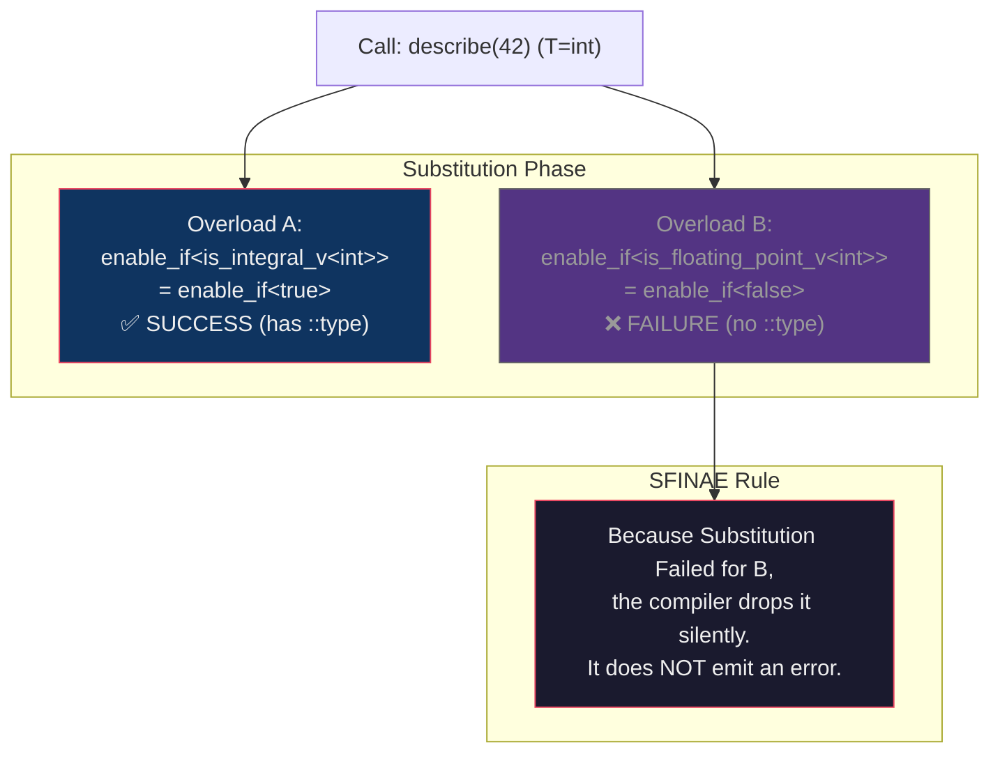

# Section 3 Deep Dive — SFINAE & `enable_if`

> **Source**: [03_sfinae_enable_if.cpp](file:///Users/arkaj/Desktop/Low-Latency-CPP/mini_quote_engine/cpp-high-performance/09-compile-time-programming/code/03_sfinae_enable_if.cpp) (238 lines)
> **Build**: `g++ -std=c++20 -O2 -Wall -o 03_sfinae_enable_if 03_sfinae_enable_if.cpp`

---

## 📋 Program Output

```
=== SFINAE & enable_if ===

describe(42)   = integral
describe(3.14) = floating_point

--- safe_abs ---
safe_abs(-7)    = 7
safe_abs(-3.14) = 3.14

--- Trait Detection (void_t) ---
SpotOrder has price:    1
MarketOrder has price:  0
SpotOrder has submit:   1
FuturesOrder has submit:0

--- Detection Idiom ---
is_detected<price_op, SpotOrder>:   1
is_detected<price_op, MarketOrder>: 0

--- Order Routing ---
Direct submit path
Gateway route for order with price
Market order path (no price, no submit)
```

---

## 🔬 Section-by-Section Breakdown

### §1. Basic SFINAE (Lines 23–31)

```cpp
// Overload A: only for integral types
template <typename T>
typename std::enable_if<std::is_integral_v<T>, std::string>::type
describe(T) { return "integral"; }

// Overload B: only for floating-point types
template <typename T>
typename std::enable_if<std::is_floating_point_v<T>, std::string>::type
describe(T) { return "floating_point"; }
```

#### What is SFINAE?
SFINAE stands for **Substitution Failure Is Not An Error**. It is the fundamental rule that makes modern C++ template metaprogramming possible. 

When you call `describe(42)` (where `T = int`), the compiler looks at all templates named `describe` and tries to "substitute" `int` for `T`.



If SFINAE didn't exist, the failure in Overload B would crash the compilation. Because of SFINAE, the compiler just says "Oh, this template wasn't meant for `int`" and moves on. Since Overload A succeeds, it's the only one left, so no ambiguity exists.

---

### §2. `std::enable_if` Forms (Lines 40–57)

`std::enable_if` is a struct that has a `::type` alias **if and only if** its first boolean argument is `true`. We use it to trigger SFINAE. 

You can put it in three places:

| Form | Syntax | Where to use |
|------|--------|--------------|
| **Template Param** | `template <typename T, typename = std::enable_if_t<cond>>` | Best for **class/struct** templates. |
| **Return Type** | `template <typename T> std::enable_if_t<cond, T> func()` | Best for **function** templates (unless constructors). |
| **Pointer Param** | `template <typename T, std::enable_if_t<cond>* = nullptr>` | Best for **constructors** (which have no return type). |

> [!NOTE]
> `std::enable_if_t<...>` is a C++14 helper that saves you from typing `typename std::enable_if<...>::type`.

---

### §3. `std::void_t` Detection (Lines 63–112)

This is a magical C++17 trick to probe if a type has a specific capability.

```cpp
// 1. Primary template (fallback)
template <typename T, typename = void>
struct has_price : std::false_type {};

// 2. Partial Specialization
template <typename T>
struct has_price<T, std::void_t<decltype(std::declval<T>().price())>>
    : std::true_type {};
```

#### How it probes the type
`std::void_t` is defined simply as: `template <typename...> using void_t = void;`. It just eats whatever types you give it and turns them into `void`.

But the magic happens *before* it becomes `void`.
When the compiler evaluates `has_price<SpotOrder>`:
1. It looks at the Partial Specialization.
2. It evaluates `decltype(std::declval<SpotOrder>().price())`.
3. `SpotOrder` **has** a `.price()` method! The expression is valid.
4. `std::void_t` turns the valid type into `void`.
5. The specialization becomes `has_price<SpotOrder, void>`.
6. This perfectly matches the primary template's signature (`T, void`). The compiler picks the specialization (`true_type`).

When the compiler evaluates `has_price<MarketOrder>`:
1. It looks at the Partial Specialization.
2. It evaluates `decltype(std::declval<MarketOrder>().price())`.
3. `MarketOrder` **does NOT** have a `.price()` method! The expression is **invalid**.
4. **SFINAE KICKS IN:** The compiler says "Substitution failed." It silently drops the partial specialization.
5. The compiler falls back to the primary template (`false_type`).

**Result:** Zero-cost, compile-time detection of object capabilities!

---

### §4. The Detection Idiom (Lines 131–178)

Writing `void_t` boilerplate for every method gets tedious. The **Detection Idiom** (originally proposed for the C++ standard library as `std::is_detected`) generalizes this into a reusable toolkit.

```cpp
// 1. Define the operations you care about
template <typename T> using price_op  = decltype(std::declval<T>().price());
template <typename T> using submit_op = decltype(std::declval<T>().submit());

// 2. Ask questions about types!
static_assert( is_detected<price_op, SpotOrder>::value);
static_assert(!is_detected<price_op, MarketOrder>::value);

// 3. Extract the return types (returns 'nonesuch' if missing)
using SpotPriceType = detected_t<price_op, SpotOrder>;   // double
```

This is incredibly powerful for generic programming. It allows you to write functions that adapt themselves to the capabilities of whatever type is passed to them.

---

### §5. HFT Pattern: Capability-Based Routing (Lines 183–196)

We combine the Detection Idiom with `if constexpr` from Section 1 to build an intelligent, zero-cost order router.

```cpp
template <typename T>
void route_order(const T& order) {
    if constexpr (is_detected<submit_op, T>::value) {
        // Fast path: Type has its own submit() method
        const_cast<T&>(order).submit();
    } else if constexpr (is_detected<price_op, T>::value) {
        // Gateway path: Type has a price, but can't submit itself
        std::cout << "Gateway route for order with price\n";
    } else {
        // Slow path: Market order (no price, no submit)
        std::cout << "Market order path (no price, no submit)\n";
    }
}
```

#### The Assembly Proof: Total Elimination

When we call `route_order()` with our three different objects in `main()`:
```cpp
SpotOrder spot;       // Has submit() and price()
FuturesOrder futures; // Has price(), NO submit()
MarketOrder market;   // NO price(), NO submit()

route_order(spot);
route_order(futures);
route_order(market);
```

Because `is_detected` evaluates entirely at compile-time, and `if constexpr` guarantees the unused branches are discarded, **there are no `if` statements in the final binary**.

Looking at the compiled assembly from your machine:
```asm
; The SpotOrder path compiles directly to printing the fast path string
lea  rsi, [rip + L_.str.19]  ; "Direct submit path\n"
call cout

; The FuturesOrder path compiles directly to printing the gateway string
lea  rsi, [rip + L_.str.20]  ; "Gateway route for order with price\n"
call cout

; The MarketOrder path compiles directly to printing the slow path string
lea  rsi, [rip + L_.str.21]  ; "Market order path (no price, no submit)\n"
call cout
```

**Zero overhead.** The function `route_order` was perfectly adapted to three completely different structs, and fully inlined, all without any inheritance, base classes, or runtime type checks.

---

### 🧠 Core Takeaways

1. **SFINAE is silent dropping:** If a template substitution creates an invalid expression, it's not a compile error—it's just silently removed from the list of candidates.
2. **`void_t` probes validity:** By putting a `decltype(expression)` inside a `void_t`, you force the compiler to check if the expression is valid during the substitution phase.
3. **Compile-Time "Duck Typing":** SFINAE allows us to ask "Does this type have a `.price()` method?" instead of asking "Does this type inherit from `Priceable`?". 
4. **Concepts are better:** SFINAE is incredibly powerful, but as you can see, the syntax (`std::enable_if_t`, `void_t`) is quite ugly and hard to read. In **Section 6**, we will see how C++20 Concepts replace this entire file with a much cleaner syntax!
