# Chapter 9 — Compile-Time Programming: Architectural Deep Dive

> **Module**: [09-compile-time-programming](file:///Users/arkaj/Desktop/Low-Latency-CPP/mini_quote_engine/cpp-high-performance/09-compile-time-programming)
> **Source**: C++ High Performance (2nd Ed.) | Björn Andrist & Viktor Sehr
> **Focus**: Zero-cost abstractions for HFT hot paths via compile-time computation

---

## 📐 Module Architecture — The Big Picture

The module is structured as a **layered learning path** — each file builds on concepts from the previous one, culminating in production HFT patterns that combine everything.

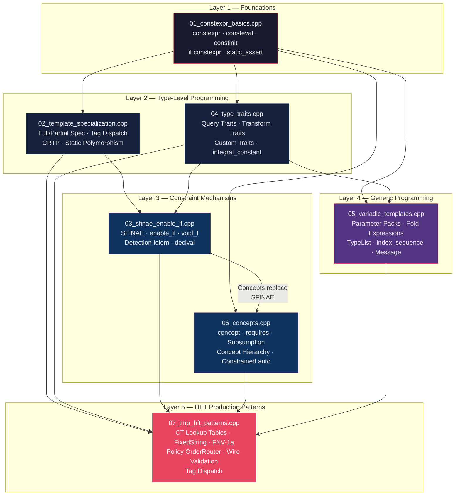

---

## 🗂 File-by-File Breakdown

| # | File | Lines | Key Concepts | Depends On |
|---|------|-------|--------------|------------|
| 1 | [01_constexpr_basics.cpp](file:///Users/arkaj/Desktop/Low-Latency-CPP/mini_quote_engine/cpp-high-performance/09-compile-time-programming/code/01_constexpr_basics.cpp) | 187 | `constexpr`, `consteval`, `constinit`, `if constexpr`, `static_assert` | — |
| 2 | [02_template_specialization.cpp](file:///Users/arkaj/Desktop/Low-Latency-CPP/mini_quote_engine/cpp-high-performance/09-compile-time-programming/code/02_template_specialization.cpp) | 280 | Full/Partial spec, Tag Dispatch, CRTP, Mixin, Benchmark | File 1 |
| 3 | [03_sfinae_enable_if.cpp](file:///Users/arkaj/Desktop/Low-Latency-CPP/mini_quote_engine/cpp-high-performance/09-compile-time-programming/code/03_sfinae_enable_if.cpp) | 238 | SFINAE, `enable_if`, `void_t`, Detection Idiom, `declval` | Files 1-2 |
| 4 | [04_type_traits.cpp](file:///Users/arkaj/Desktop/Low-Latency-CPP/mini_quote_engine/cpp-high-performance/09-compile-time-programming/code/04_type_traits.cpp) | 231 | Query/Transform traits, Custom traits, `integral_constant`, `common_type` | File 1 |
| 5 | [05_variadic_templates.cpp](file:///Users/arkaj/Desktop/Low-Latency-CPP/mini_quote_engine/cpp-high-performance/09-compile-time-programming/code/05_variadic_templates.cpp) | 268 | Parameter packs, Fold expressions, TypeList, `index_sequence`, Message | Files 1, 4 |
| 6 | [06_concepts.cpp](file:///Users/arkaj/Desktop/Low-Latency-CPP/mini_quote_engine/cpp-high-performance/09-compile-time-programming/code/06_concepts.cpp) | 264 | `concept`, `requires`, Concept hierarchy, Subsumption, `RiskEngine` | Files 1, 3 |
| 7 | [07_tmp_hft_patterns.cpp](file:///Users/arkaj/Desktop/Low-Latency-CPP/mini_quote_engine/cpp-high-performance/09-compile-time-programming/code/07_tmp_hft_patterns.cpp) | 327 | CT lookup, FNV-1a, FixedString, Policy Router, Wire validation, Tag dispatch | All |

---

## 1️⃣ File 01 — `constexpr` Basics: The Foundation

> [01_constexpr_basics.cpp](file:///Users/arkaj/Desktop/Low-Latency-CPP/mini_quote_engine/cpp-high-performance/09-compile-time-programming/code/01_constexpr_basics.cpp)

### Compile-Time Evaluation Pipeline

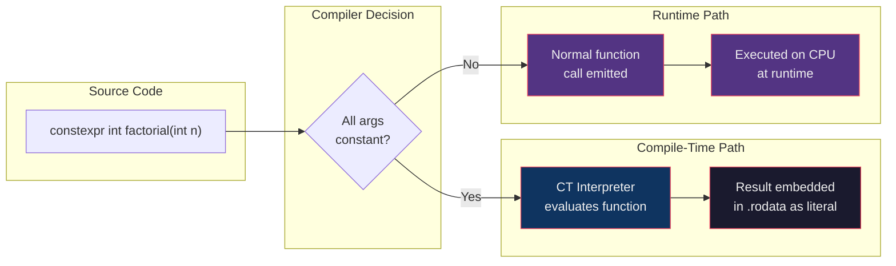

### The `constexpr` / `consteval` / `constinit` Triad

These three keywords form a **spectrum of compile-time guarantees**:

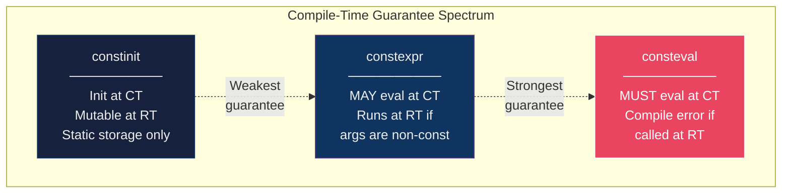

### Key Code Walkthrough

#### `constexpr` function — dual CT/RT capability
```cpp
// Lines 23-28: A single function that works in both worlds
constexpr int factorial(int n) {
    // C++14 relaxation: loops and local vars allowed in constexpr
    int result = 1;
    for (int i = 2; i <= n; i++) result *= i;
    return result;
}

// Lines 31-34: PROOF of compile-time evaluation
// static_assert runs ONLY at compile time — if this compiles, factorial ran at CT
static_assert(factorial(0)  == 1);
static_assert(factorial(5)  == 120);
static_assert(factorial(10) == 3628800);
```

> [!IMPORTANT]
> `static_assert` is the definitive proof that a value was computed at compile time. If the program compiles, the assertion passed — zero runtime cost.

#### `consteval` — the "no escape" guarantee
```cpp
// Lines 51-53: This function CANNOT run at runtime. Period.
consteval int compile_time_only(int n) {
    return n * n;
}

// This is fine:
static_assert(compile_time_only(7) == 49);

// This would be a COMPILE ERROR (uncomment to see):
// int x = 7;
// int y = compile_time_only(x);   // ERROR: x is not a constant expression
```

> [!TIP]
> Use `consteval` for things like encryption keys, configuration constants, or hash computations that must NEVER leak to runtime code paths. The compiler enforces this contract.

#### `constinit` — solving the Static Initialization Order Fiasco
```cpp
// Lines 67-68: Variables initialized at compile time, but remain MUTABLE
constinit int g_session_id = 42;     // initialized before any dynamic init
constinit double g_risk_limit = 1e6; // guaranteed no SIOF

// Line 71: Fine to modify at runtime — constinit != const
void update_risk_limit(double new_limit) { g_risk_limit = new_limit; }
```

> [!WARNING]
> **SIOF (Static Initialization Order Fiasco)**: When global `Foo` in TU-A depends on global `Bar` in TU-B, C++ doesn't guarantee which initializes first. `constinit` forces compile-time initialization, breaking the dependency chain.

#### `if constexpr` — zero-cost branching
```cpp
// Lines 77-87: Compiler DISCARDS the unused branch — it's never compiled
template <typename T>
std::string to_string_ct(T val) {
    if constexpr (std::is_integral_v<T>) {
        return "int:" + std::to_string(val);    // ONLY compiled for integral T
    } else if constexpr (std::is_floating_point_v<T>) {
        return "float:" + std::to_string(val);  // ONLY compiled for floating-point T
    } else {
        return "other";                          // ONLY compiled for everything else
    }
}
```

#### HFT Pattern — zero-copy serialization via `if constexpr`
```cpp
// Lines 90-99: Compile-time path selection for serialization
template <typename T>
void serialize_to_buffer(const T& val, char* buf) {
    if constexpr (std::is_trivially_copyable_v<T>) {
        // For POD types: direct memcpy — branchless, vectorizable, ~1 ns
        __builtin_memcpy(buf, &val, sizeof(T));
    } else {
        // For complex types: call T's serialize method
        // This branch is NEVER instantiated for POD types
        val.serialize(buf);
    }
}
```

#### HFT Pattern — endian swap at compile time
```cpp
// Lines 107-117: Market data arrives big-endian; most hosts are little-endian
template <typename T>
constexpr T from_big_endian(T val) {
    static_assert(std::is_integral_v<T>, "T must be integral");
    if constexpr (std::endian::native == std::endian::little) {
        // On little-endian: compiler emits bswap instruction
        if constexpr (sizeof(T) == 2) return __builtin_bswap16(val);
        if constexpr (sizeof(T) == 4) return __builtin_bswap32(val);
        if constexpr (sizeof(T) == 8) return __builtin_bswap64(val);
    }
    return val;  // On big-endian: compiler emits NOTHING — complete no-op
}
```

> [!NOTE]
> The beauty: on a little-endian x86 machine, the compiler emits a single `bswap` instruction. On big-endian (e.g., some ARM configs), it emits nothing. Zero branches in the binary.

#### `constexpr` class — compile-time config objects
```cpp
// Lines 142-158: Entire configuration computed at compile time
struct VenueConfig {
    int    max_orders;
    double tick_size;
    double max_notional;

    constexpr VenueConfig(int max, double tick)
        : max_orders(max), tick_size(tick)
        , max_notional(max * tick * 1000.0) {}  // derived value computed at CT
};

constexpr VenueConfig kNasdaqConfig { 2048, 0.01 };
constexpr VenueConfig kCMEConfig    { 512,  0.25 };

// Verified at compile time — these constants are in .rodata
static_assert(kNasdaqConfig.max_orders == 2048);
static_assert(kCMEConfig.tick_size     == 0.25);
```

---

## 2️⃣ File 02 — Template Specialization & CRTP

> [02_template_specialization.cpp](file:///Users/arkaj/Desktop/Low-Latency-CPP/mini_quote_engine/cpp-high-performance/09-compile-time-programming/code/02_template_specialization.cpp)

### Template Specialization Hierarchy

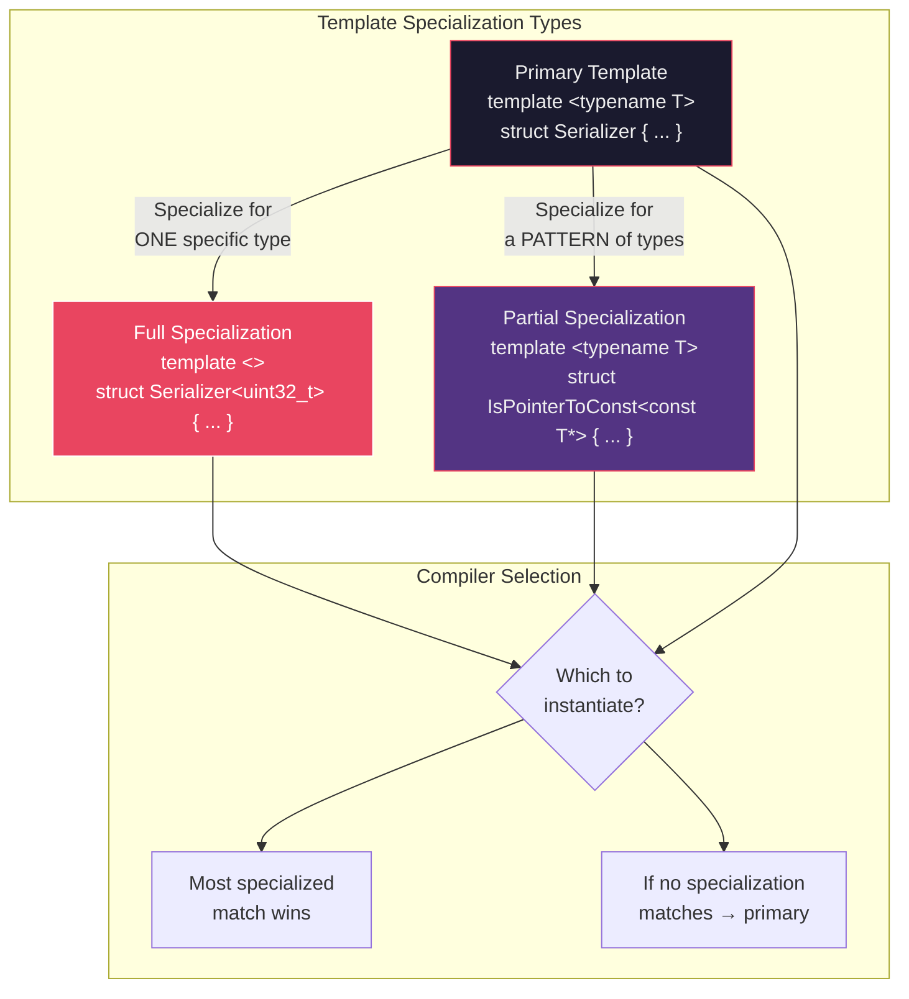

### Key Code Walkthrough

#### Full specialization — type-specific fast paths
```cpp
// Lines 26-33: Primary template — generic fallback
template <typename T>
struct Serializer {
    static void serialize(const T& val, char* buf) {
        val.serialize(buf);  // calls T's member function (slow path)
    }
    static constexpr size_t size() { return sizeof(T); }
};

// Lines 36-42: Full specialization for uint32_t — raw memcpy (fast path)
template <>
struct Serializer<uint32_t> {
    static void serialize(uint32_t val, char* buf) {
        __builtin_memcpy(buf, &val, 4);  // single 4-byte copy, vectorizable
    }
    static constexpr size_t size() { return 4; }
};
```

> [!TIP]
> Full specialization lets you provide hand-optimized implementations for specific types while keeping a generic fallback. The compiler picks the most specific match automatically.

#### Tag Dispatch — zero-overhead type routing

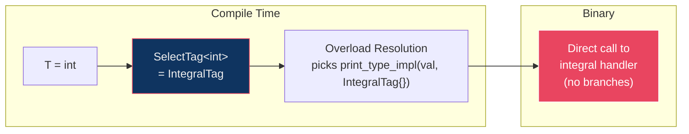

```cpp
// Lines 83-112: Tag dispatch — compile-time type selection
struct IntegralTag   {};   // Empty structs — zero size, zero cost
struct FloatingTag   {};
struct OtherTag      {};

// SelectTag maps T → the right tag at compile time
template <typename T>
using SelectTag = std::conditional_t<
    std::is_integral_v<T>,
    IntegralTag,
    std::conditional_t<std::is_floating_point_v<T>, FloatingTag, OtherTag>
>;

// Each overload handles one category — compiler picks at instantiation time
template <typename T>
void print_type_impl(T val, IntegralTag) {
    std::cout << "INT: " << val << "\n";
}

// Public API: tag is a zero-size temporary, optimized away completely
template <typename T>
void print_type(T val) {
    print_type_impl(val, SelectTag<T>{});  // tag = zero bytes, eliminated by optimizer
}
```

### CRTP — Static Polymorphism Architecture

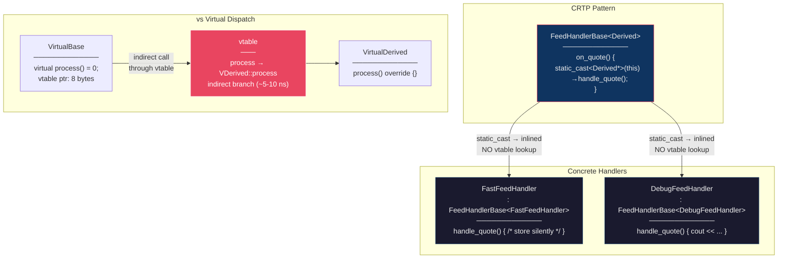

```cpp
// Lines 119-130: CRTP base — the key is static_cast<Derived*>(this)
template <typename Derived>
struct FeedHandlerBase {
    void on_quote(uint64_t instr_id, double bid, double ask) {
        // This static_cast is resolved at COMPILE TIME
        // The compiler knows Derived is FastFeedHandler or DebugFeedHandler
        // → the call to handle_quote() is a DIRECT call, fully inlinable
        static_cast<Derived*>(this)->handle_quote(instr_id, bid, ask);
    }
};

// Lines 133-141: Concrete handler — the compiler inlines handle_quote
struct FastFeedHandler : FeedHandlerBase<FastFeedHandler> {
    void handle_quote(uint64_t id, double bid, double ask) {
        (void)id; (void)bid; (void)ask;  // no-op: just store, no logging
    }
};
```

> [!IMPORTANT]
> **Assembly comparison** (from the benchmark at lines 221-243):
> - **Virtual**: `mov rax, [rdi]` (load vtable) → `call [rax+offset]` (indirect branch) → **~5-10 ns/call**
> - **CRTP**: `call FastFeedHandler::handle_quote` (direct call, inlined) → **~0-0.3 ns/call**
> 
> The benchmark at line 222 runs 50M calls to measure this difference.

### CRTP Mixin — composing multiple policies
```cpp
// Lines 158-197: Multiple CRTP bases = multiple policies, ALL inlined
struct AlgoTrader
    : LatencyMixin<AlgoTrader>    // adds record_send_time(), latency_ns()
    , RiskMixin<AlgoTrader>       // adds risk_check()
{
    static constexpr double max_notional_ = 1e6;

    void submit_order(double notional) {
        if (!risk_check(notional)) {           // inlined from RiskMixin
            std::cout << "REJECTED\n";
            return;
        }
        record_send_time();                     // inlined from LatencyMixin
        // … send order …
        std::cout << "latency=" << latency_ns() << " ns\n";
    }
};
```

---

## 3️⃣ File 03 — SFINAE & `enable_if`

> [03_sfinae_enable_if.cpp](file:///Users/arkaj/Desktop/Low-Latency-CPP/mini_quote_engine/cpp-high-performance/09-compile-time-programming/code/03_sfinae_enable_if.cpp)

### SFINAE Decision Flow

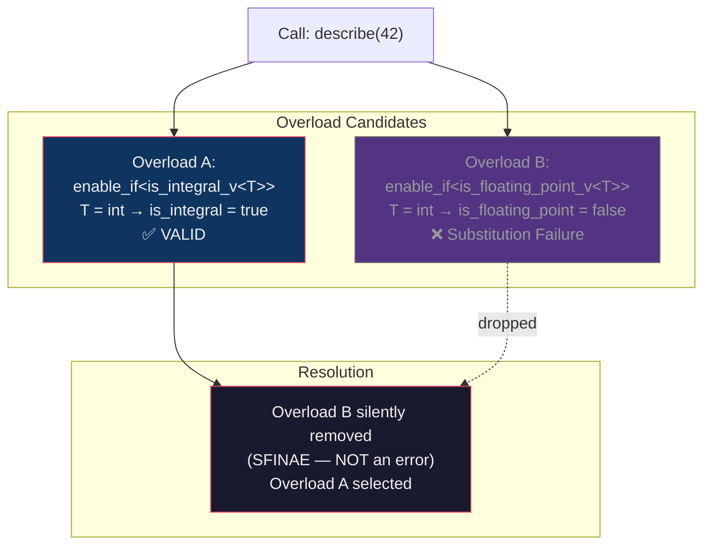

### `enable_if` — Three Syntactic Forms

```cpp
// Form 1 (Lines 41-45): Default template parameter — most common for class constraints
template <typename T, typename = std::enable_if_t<std::is_integral_v<T>>>
struct IntBox { T value; };
// IntBox<int> box{42};      // ✅ compiles
// IntBox<double> box{3.14}; // ❌ substitution failure → no matching template

// Form 2 (Lines 49-51): Return type — clean for function overloads
template <typename T>
std::enable_if_t<std::is_arithmetic_v<T>, T>
safe_abs(T x) { return x < 0 ? -x : x; }

// Form 3 (Lines 54-57): Extra pointer parameter — avoids return-type issues
template <typename T, std::enable_if_t<std::is_floating_point_v<T>>* = nullptr>
void print_precise(T val) { std::cout << std::fixed << val << "\n"; }
```

### `void_t` Detection — Capability Probing

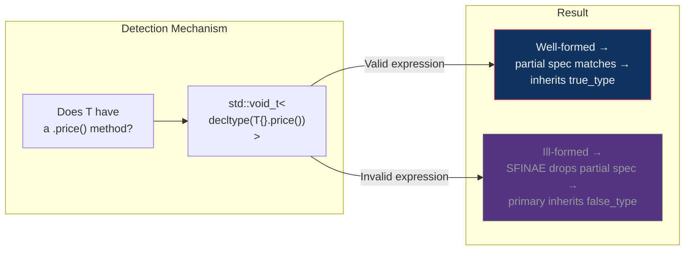

```cpp
// Lines 64-69: void_t pattern — detect if T has a .price() method
template <typename T, typename = void>
struct has_price : std::false_type {};       // Primary: assume no

template <typename T>
struct has_price<T, std::void_t<decltype(std::declval<T>().price())>>
    : std::true_type {};                      // Partial spec: matches if .price() exists

// Lines 103-108: Verified at compile time
static_assert( has_price<SpotOrder>::value);      // SpotOrder has price()
static_assert(!has_price<MarketOrder>::value);     // MarketOrder doesn't
static_assert( has_submit<SpotOrder>::value);      // SpotOrder has submit()
static_assert(!has_submit<FuturesOrder>::value);   // FuturesOrder doesn't
```

### Detection Idiom — Generalized Capability Probe

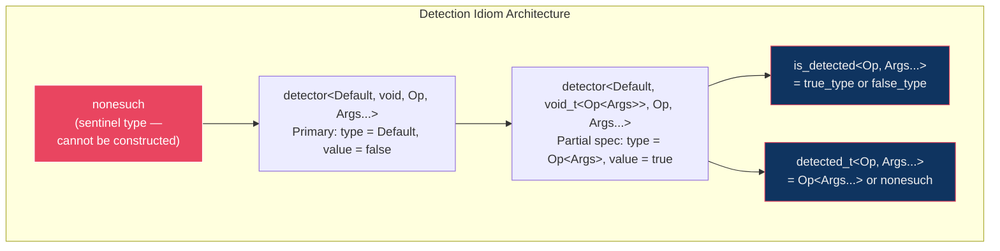

```cpp
// Lines 162-164: Define "operations" as type aliases
template <typename T> using price_op  = decltype(std::declval<T>().price());
template <typename T> using submit_op = decltype(std::declval<T>().submit());
template <typename T> using qty_op    = decltype(std::declval<T>().quantity());

// Lines 167-177: Use is_detected to probe capabilities
static_assert( is_detected<price_op,  SpotOrder>::value);   // has .price()
static_assert(!is_detected<price_op,  MarketOrder>::value); // no .price()

// Get the RETURN TYPE of the detected operation (or nonesuch if absent)
using SpotPriceType   = detected_t<price_op, SpotOrder>;    // = double
using MarketPriceType = detected_t<price_op, MarketOrder>;  // = nonesuch
```

### HFT Pattern — capability-based order routing
```cpp
// Lines 183-196: Dispatch to fast/slow path based on detected capabilities
template <typename T>
void route_order(const T& order) {
    if constexpr (is_detected<submit_op, T>::value) {
        // Fast path: type has submit() → use it directly (no gateway overhead)
        const_cast<T&>(order).submit();
    } else if constexpr (is_detected<price_op, T>::value) {
        // Medium path: has price but no submit → use generic gateway
        std::cout << "Gateway route\n";
    } else {
        // Slow path: market order — special handling
        std::cout << "Market order path\n";
    }
}
```

---

## 4️⃣ File 04 — Type Traits

> [04_type_traits.cpp](file:///Users/arkaj/Desktop/Low-Latency-CPP/mini_quote_engine/cpp-high-performance/09-compile-time-programming/code/04_type_traits.cpp)

### Type Traits Taxonomy

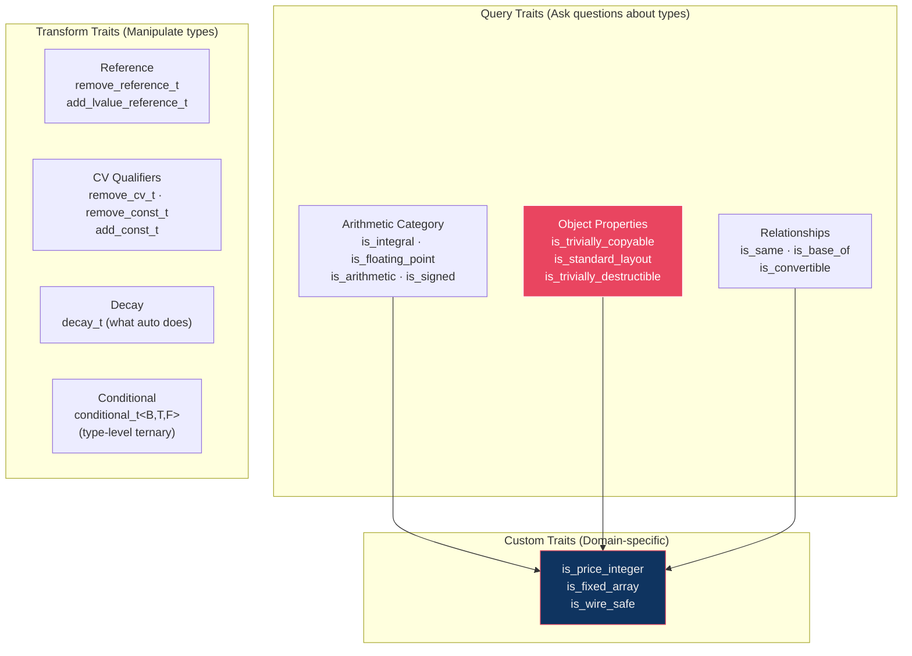

### Custom Trait — `is_wire_safe_v` (HFT serialization guard)
```cpp
// Lines 121-125: Composite trait — combines three conditions
template <typename T>
inline constexpr bool is_wire_safe_v =
    std::is_trivially_copyable_v<T>   &&   // safe to memcpy
    std::is_standard_layout_v<T>      &&   // C-compatible memory layout
    !std::is_pointer_v<T>;                  // no raw pointers on the wire

// Lines 127-133: Wire-safe message struct
struct WireMessage {
    uint64_t seq_num;    // 8 bytes
    int32_t  price;      // 4 bytes
    int32_t  quantity;   // 4 bytes
};
static_assert(is_wire_safe_v<WireMessage>);    // ✅ safe for zero-copy
static_assert(!is_wire_safe_v<std::string>);   // ❌ not trivially copyable
```

### Generic serialize using `if constexpr` + traits
```cpp
// Lines 155-171: Type-safe serialization — compiler selects the right path
template <typename T>
size_t safe_serialize(const T& val, char* buf) {
    if constexpr (is_wire_safe_v<T>) {
        // POD path: single memcpy, ~1 ns, no constructor calls
        std::memcpy(buf, &val, sizeof(T));
        return sizeof(T);
    } else if constexpr (std::is_same_v<T, std::string>) {
        // String path: length-prefixed encoding
        uint32_t len = static_cast<uint32_t>(val.size());
        std::memcpy(buf, &len, 4);
        std::memcpy(buf + 4, val.data(), len);
        return 4 + len;
    } else {
        // No serialization strategy — caught at COMPILE TIME, not runtime
        static_assert(sizeof(T) == 0, "No serialization strategy for this type");
    }
}
```

> [!CAUTION]
> The `static_assert(sizeof(T) == 0, ...)` trick in the `else` branch is a compile-time safeguard. It only triggers if someone tries to serialize a type that has no serialization strategy — the error appears at build time, not in production.

---

## 5️⃣ File 05 — Variadic Templates

> [05_variadic_templates.cpp](file:///Users/arkaj/Desktop/Low-Latency-CPP/mini_quote_engine/cpp-high-performance/09-compile-time-programming/code/05_variadic_templates.cpp)

### Fold Expression Expansion

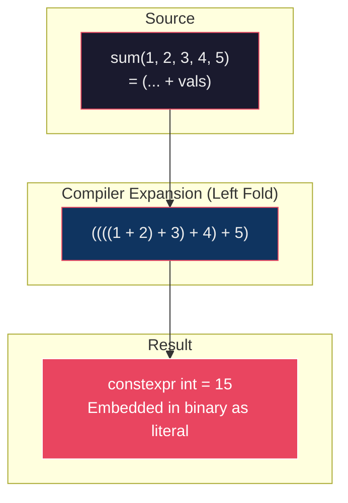

### Pre-C++17 Recursion vs C++17 Fold Expressions

````carousel
**Pre-C++17: Recursive Pack Unpacking**
```cpp
// Lines 40-50: Head + Tail recursion — verbose but essential to understand
void print_recursive() { std::cout << "\n"; }   // Base case: empty pack

template <typename Head, typename... Tail>
void print_recursive(const Head& h, const Tail&... t) {
    std::cout << h;
    if constexpr (sizeof...(t) > 0) std::cout << ", ";
    print_recursive(t...);     // recursive call with one fewer arg
}
// print_recursive(1, 2.5, "hello", 'x')
// → prints: 1, 2.5, hello, x
```
<!-- slide -->
**C++17: Fold Expressions — Same result, no recursion**
```cpp
// Lines 57-68: Clean, no recursion, no base case
template <typename... Ts>
constexpr auto sum(Ts... vals) { return (... + vals); }         // Left fold

template <typename... Ts>
void print_all(Ts... vals) {
    ((std::cout << vals << ' '), ...);   // Comma fold: executes for each
    std::cout << "\n";
}

// Boolean folds — check all/any conditions
template <typename... Ts>
constexpr bool all_positive(Ts... vals) { return ((vals > 0) && ...); }
```
````

### TypeList — Compile-Time Type Algebra

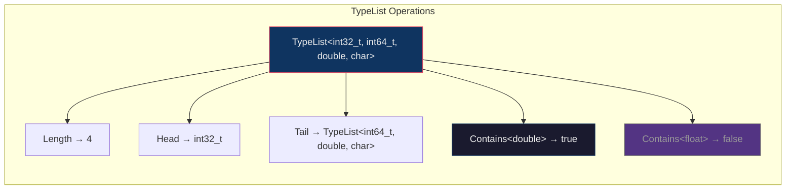

```cpp
// Lines 121-151: TypeList — a compile-time list of types
template <typename... Ts> struct TypeList {
    static constexpr size_t size = sizeof...(Ts);
};

// Contains — uses fold expression inside a trait
template <typename T, typename... Ts>
struct Contains<T, TypeList<Ts...>>
    : std::bool_constant<(std::is_same_v<T, Ts> || ...)> {};
//                        ^^^^^^^^^^^^^^^^^^^^^^^^^^^^^^^^
//                        Fold expression expands to:
//                        is_same<T, Ts1> || is_same<T, Ts2> || ...
```

### HFT Message — Variadic struct with static field iteration
```cpp
// Lines 166-189: Variadic message — fields as a tuple
template <typename... Fields>
struct Message {
    using FieldTuple = std::tuple<Fields...>;
    static constexpr size_t num_fields = sizeof...(Fields);
    FieldTuple fields;

    // Serialize ALL fields — unrolled at compile time via fold expression
    size_t serialize(char* buf) const {
        size_t offset = 0;
        for_each_impl(fields, [&](const auto& field) {
            using F = std::decay_t<decltype(field)>;
            if constexpr (std::is_trivially_copyable_v<F>) {
                __builtin_memcpy(buf + offset, &field, sizeof(F));
                offset += sizeof(F);
            }
        }, std::index_sequence_for<Fields...>{});
        return offset;
    }
};

// Lines 191-194: Concrete message type
using QuoteMsg = Message<uint64_t, int32_t, int32_t, int32_t, int32_t>;
//                       instr_id  bid_px   ask_px   bid_qty  ask_qty
static_assert(QuoteMsg::num_fields == 5);
```

> [!NOTE]
> The `for_each_impl` + fold expression compiles down to 5 sequential `memcpy` calls with compile-time-known sizes. The compiler can merge them into a single large copy or vectorize them with SIMD instructions.

---

## 6️⃣ File 06 — C++20 Concepts

> [06_concepts.cpp](file:///Users/arkaj/Desktop/Low-Latency-CPP/mini_quote_engine/cpp-high-performance/09-compile-time-programming/code/06_concepts.cpp)

### Concept Hierarchy — HFT Order Types

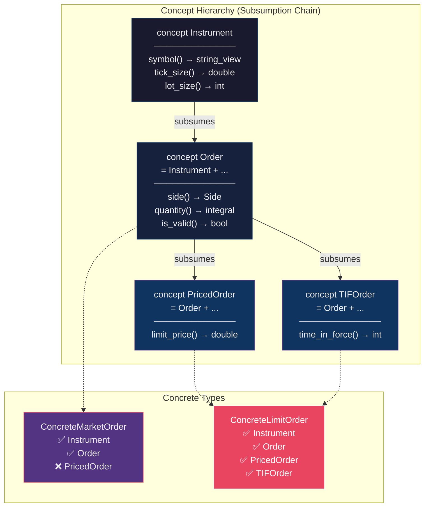

### Four Equivalent Ways to Constrain Templates

```cpp
// Lines 41-53: All four syntaxes produce IDENTICAL code
// Syntax 1: concept name before parameter
template <Numeric T>
T add_v1(T a, T b) { return a + b; }

// Syntax 2: requires clause after template parameter list
template <typename T> requires Numeric<T>
T add_v2(T a, T b) { return a + b; }

// Syntax 3: trailing requires clause
template <typename T>
T add_v3(T a, T b) requires Numeric<T> { return a + b; }

// Syntax 4: abbreviated function template (C++20)
Numeric auto add_v4(Numeric auto a, Numeric auto b) { return a + b; }
```

### Concept Subsumption — automatic overload selection

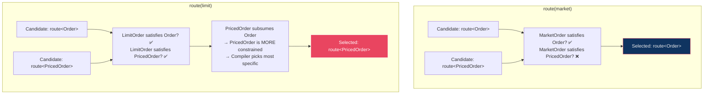

```cpp
// Lines 159-168: Overloads with different concept constraints
template <Order O>         // less constrained
void route(const O& o) {
    std::cout << "Generic order routing\n";
}

template <PricedOrder O>   // more constrained (subsumes Order)
void route(const O& o) {
    std::cout << "Limit order routing, price=" << o.limit_price() << "\n";
}

// Lines 244-246: Compiler picks automatically — no ambiguity
route(market);   // → picks Order overload (MarketOrder has no limit_price)
route(limit);    // → picks PricedOrder overload (more specific)
```

> [!IMPORTANT]
> **Why Concepts beat SFINAE:**
> 1. Error: `"T does not satisfy Priceable"` vs pages of template instantiation noise
> 2. Subsumption rules replace fragile overload priority tricks
> 3. Compile times are faster (compiler can short-circuit)
> 4. Concepts serve as **living documentation** of type requirements

---

## 7️⃣ File 07 — HFT Production Patterns

> [07_tmp_hft_patterns.cpp](file:///Users/arkaj/Desktop/Low-Latency-CPP/mini_quote_engine/cpp-high-performance/09-compile-time-programming/code/07_tmp_hft_patterns.cpp)

This is the **capstone file** — it combines everything into patterns you'd actually find in an HFT codebase.

### Compile-Time Lookup Table Architecture

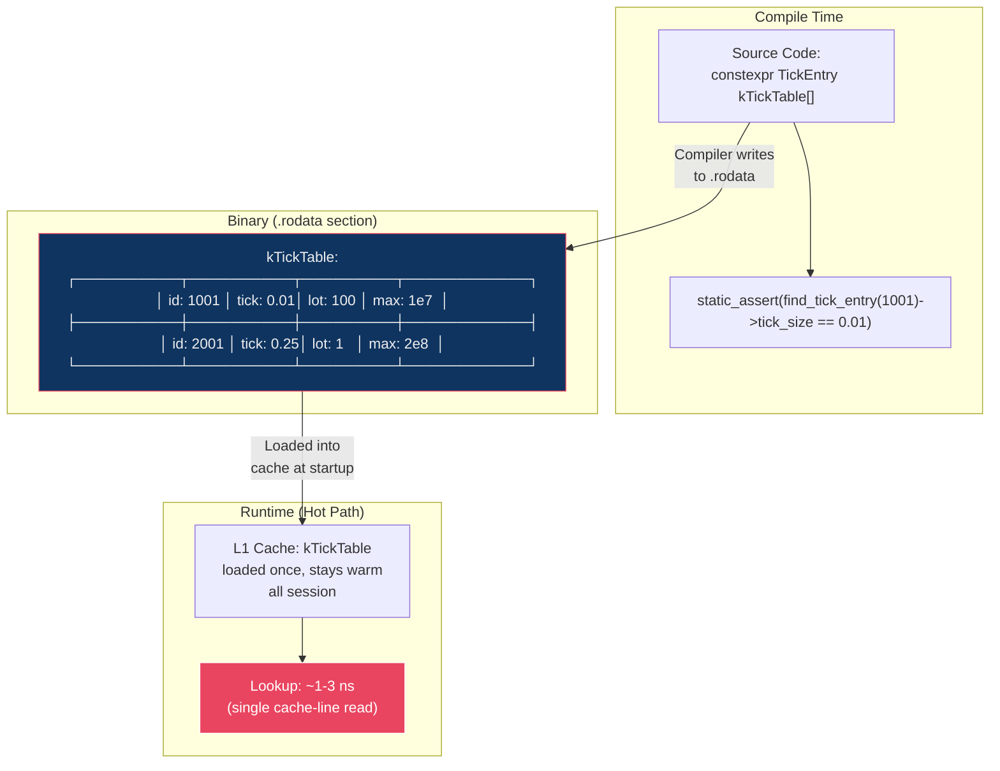

```cpp
// Lines 30-53: Compile-time tick table — lives in .rodata, no heap
struct TickEntry {
    uint32_t instrument_id;
    double   tick_size;
    int32_t  lot_size;
    double   max_notional;
};

constexpr TickEntry kTickTable[] = {
    { 1001, 0.01,  100,  1e7 },   // AAPL  (equity)
    { 2001, 0.25,    1,  2e8 },   // ES    (S&P500 futures)
    { 3001, 0.01,    1,  5e6 },   // EURUSD (FX)
    // ...
};

// Linear scan — compiler may fully unroll for small tables
constexpr const TickEntry* find_tick_entry(uint32_t id) {
    for (const auto& e : kTickTable)
        if (e.instrument_id == id) return &e;
    return nullptr;
}

// Lines 56-59: Verified at compile time — zero runtime cost for validation
static_assert(find_tick_entry(1001)->tick_size == 0.01);
static_assert(find_tick_entry(2001)->tick_size == 0.25);
static_assert(find_tick_entry(9999)            == nullptr);
```

### FNV-1a Hash — Compile-Time Symbol Interning
```cpp
// Lines 65-72: Deterministic hash computed at compile time
constexpr uint64_t fnv1a_hash(std::string_view s) {
    uint64_t hash = 14695981039346656037ULL;   // FNV offset basis
    for (char c : s) {
        hash ^= static_cast<uint64_t>(c);
        hash *= 1099511628211ULL;              // FNV prime
    }
    return hash;
}

// Proven deterministic at compile time
static_assert(fnv1a_hash("AAPL") != fnv1a_hash("MSFT"));
static_assert(fnv1a_hash("AAPL") == fnv1a_hash("AAPL"));
```

### FixedString — C++20 NTTP Class Type
```cpp
// Lines 82-109: String literal as a template parameter — the type itself IS the string
template <size_t N>
struct FixedString {
    char data[N] = {};
    constexpr FixedString(const char (&s)[N]) {
        for (size_t i = 0; i < N; i++) data[i] = s[i];
    }
    constexpr std::string_view view() const { return {data, N-1}; }
    constexpr uint64_t hash() const { return fnv1a_hash(view()); }
};

// C++20: class types as Non-Type Template Parameters
template <FixedString Symbol>
struct InstrumentTag {
    static constexpr auto name = Symbol;
    static constexpr uint64_t hash = Symbol.hash();
};

using AAPL_Tag = InstrumentTag<"AAPL">;   // "AAPL" is IN the type!
using ES_Tag   = InstrumentTag<"ES">;

static_assert(AAPL_Tag::name.view() == "AAPL");
static_assert(AAPL_Tag::hash != ES_Tag::hash);
```

> [!TIP]
> `FixedString` makes the symbol a part of the **type system**. `InstrumentTag<"AAPL">` and `InstrumentTag<"MSFT">` are entirely different types — the compiler can specialize functions per symbol, and the strings live in `.rodata` with zero heap allocation.

### Policy-Based OrderRouter Architecture

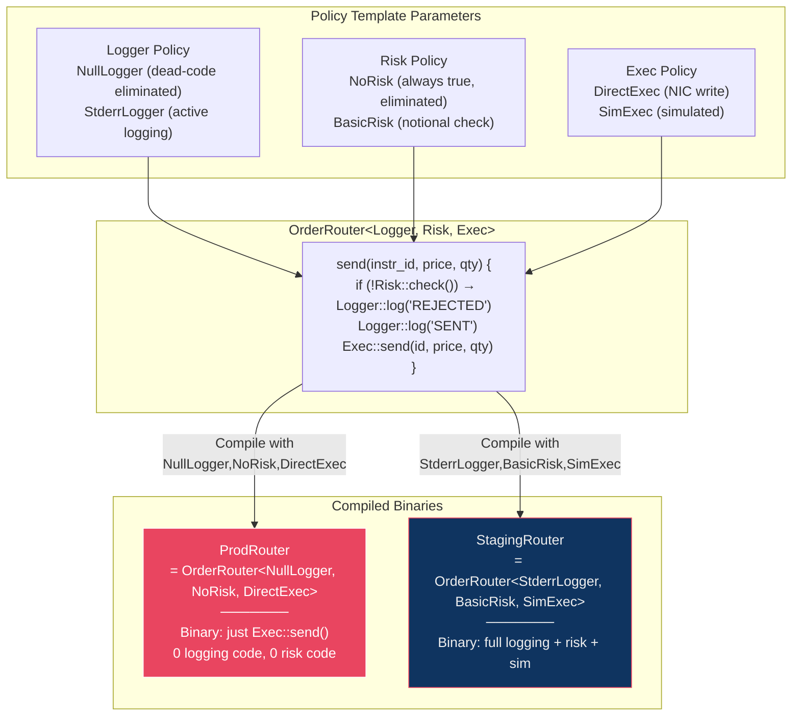

```cpp
// Lines 151-176: Policy-based design — different binaries for different configs
template <
    typename Logger = NullLogger,    // Default: no logging (eliminated entirely)
    typename Risk   = NoRisk,        // Default: no risk check (always true)
    typename Exec   = DirectExec     // Default: direct NIC write
>
class OrderRouter {
public:
    void send(uint32_t instr_id, double price, int qty) {
        double notional = price * qty;

        // If Risk = NoRisk → check() returns constexpr true
        //   → compiler eliminates entire if-block (dead code)
        if (!risk_.check(notional)) {
            Logger::log("REJECTED: notional limit exceeded");
            return;
        }

        // If Logger = NullLogger → log() is constexpr empty
        //   → compiler eliminates this call entirely
        Logger::log("ORDER SENT");
        Exec::send(instr_id, price, qty);
    }

private:
    [[no_unique_address]] Risk risk_;  // If Risk is stateless → 0 bytes!
};

// Lines 179-182: Type aliases for different environments
using ProdRouter    = OrderRouter<NullLogger, NoRisk, DirectExec>;
using StagingRouter = OrderRouter<StderrLogger, BasicRisk, SimExec>;
```

> [!IMPORTANT]
> **`[[no_unique_address]]`** (C++20): When `Risk` is a stateless type like `NoRisk`, this attribute allows the compiler to give it zero bytes of storage. The `OrderRouter` object is as small as possible.

### Wire Message Layout Validation
```cpp
// Lines 189-204: Compile-time validation that struct has no padding
struct __attribute__((packed)) QuoteMessage {
    uint64_t seq_num;    // 8
    uint32_t instr_id;   // 4
    int32_t  bid_price;  // 4
    int32_t  ask_price;  // 4
    int32_t  bid_qty;    // 4
    int32_t  ask_qty;    // 4
    uint64_t timestamp;  // 8
};                       // total = 36

// These THREE assertions guarantee wire-format correctness at COMPILE TIME
static_assert(sizeof(QuoteMessage) == 36,
    "QuoteMessage has unexpected padding — wire format corrupted");
static_assert(std::is_trivially_copyable_v<QuoteMessage>,
    "QuoteMessage must be trivially copyable for memcpy serialization");
static_assert(std::is_standard_layout_v<QuoteMessage>,
    "QuoteMessage must be standard layout for C interop");
```

> [!CAUTION]
> If a developer adds a field that introduces padding (e.g., a `bool` between two `uint64_t` fields), the `static_assert` on `sizeof` will **break the build immediately** — catching the bug before it ever reaches production.

---

## 🏗 Cross-Cutting Architecture: How Everything Connects

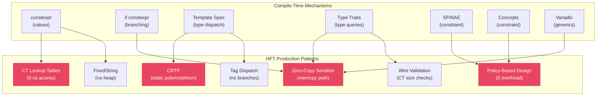

---

## ⚡ Runtime Cost Comparison

| Pattern | Runtime Cost | Mechanism | File |
|---------|-------------|-----------|------|
| `constexpr` variable | **0 ns** | Literal in `.rodata` | 01 |
| `if constexpr` branch | **0 ns** | Discarded branch not emitted | 01 |
| `static_assert` | **0 ns** | Compile-time only | All |
| CRTP dispatch | **0–0.3 ns** | Direct/inlined call | 02 |
| Concept constraint | **0 ns** | Compile-time only | 06 |
| `enable_if` / SFINAE | **0 ns** | Compile-time only | 03 |
| Tag dispatch | **0 ns** | Overload resolved at CT | 02, 07 |
| NullLogger policy | **0 ns** | Dead-code eliminated | 07 |
| CT lookup table | **~1–3 ns** | Single cache-line read | 07 |
| Virtual function | **5–10 ns** | vtable + indirect branch | 02 (benchmark) |
| `dynamic_cast` | **10–50 ns** | RTTI traversal | — |
| `std::function` | **10–50 ns** | Type erasure + indirect | — |
| Heap allocation | **50–500 ns** | malloc/new | — |

> [!IMPORTANT]
> For HFT hot paths, only the **top half of this table** (≤ 3 ns) is acceptable. The entire purpose of compile-time programming is to move computation from the bottom half to the top.

---

## 📊 Evolution: SFINAE → Concepts

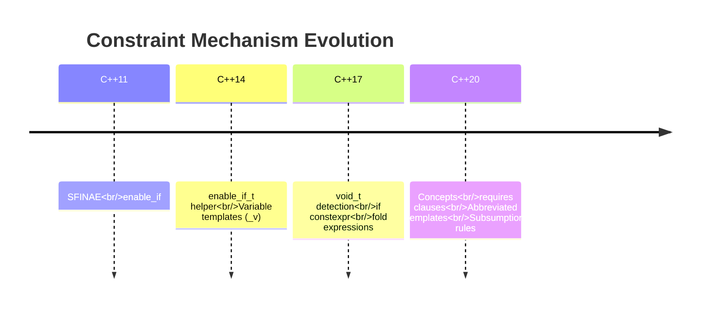

| Feature | SFINAE (C++11-17) | Concepts (C++20) |
|---------|-------------------|------------------|
| Syntax | `enable_if_t<is_integral_v<T>>` | `template <std::integral T>` |
| Error message | "candidate template ignored" | "T does not satisfy integral" |
| Overload priority | Manual tricks | Automatic subsumption |
| Compile speed | Slow (each failure costs) | Fast (short-circuit) |
| Readability | Low | High |
| File in module | [03_sfinae_enable_if.cpp](file:///Users/arkaj/Desktop/Low-Latency-CPP/mini_quote_engine/cpp-high-performance/09-compile-time-programming/code/03_sfinae_enable_if.cpp) | [06_concepts.cpp](file:///Users/arkaj/Desktop/Low-Latency-CPP/mini_quote_engine/cpp-high-performance/09-compile-time-programming/code/06_concepts.cpp) |

---

## 🔑 Key Takeaways

1. **constexpr is the foundation** — it moves computation from runtime to compile time, producing literals in `.rodata` with zero CPU cost.

2. **`if constexpr` eliminates branches** — the discarded path isn't compiled at all, enabling one function to handle radically different types.

3. **CRTP replaces virtual dispatch** — `static_cast<Derived*>(this)` resolves at compile time, enabling full inlining (0 ns vs 5-10 ns for virtual).

4. **SFINAE is powerful but ugly** — it works by exploiting substitution failure rules. C++20 Concepts are the clean replacement.

5. **Type traits are the query language** — they let you ask questions about types at compile time and select the optimal code path.

6. **Variadic templates + fold expressions** = generic programming without recursion. Essential for message structs and tuple traversal.

7. **Policy-based design is the endgame** — combine all the above into template parameters that produce different, fully-optimized binaries for different environments.

8. **Everything in File 07 is production-ready** — tick tables, FixedString, wire validation, and the policy router are patterns used in real HFT systems.
